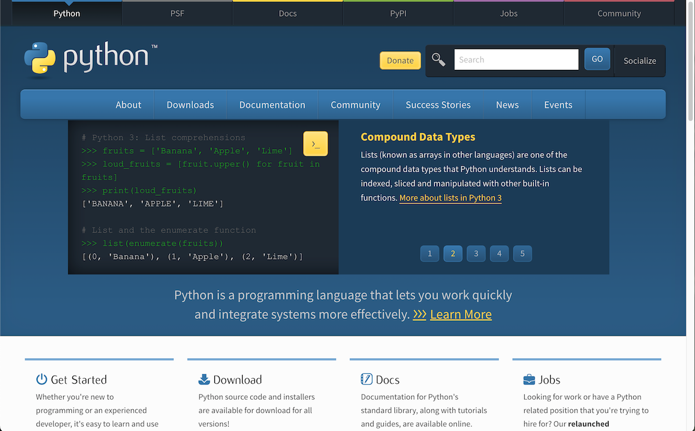
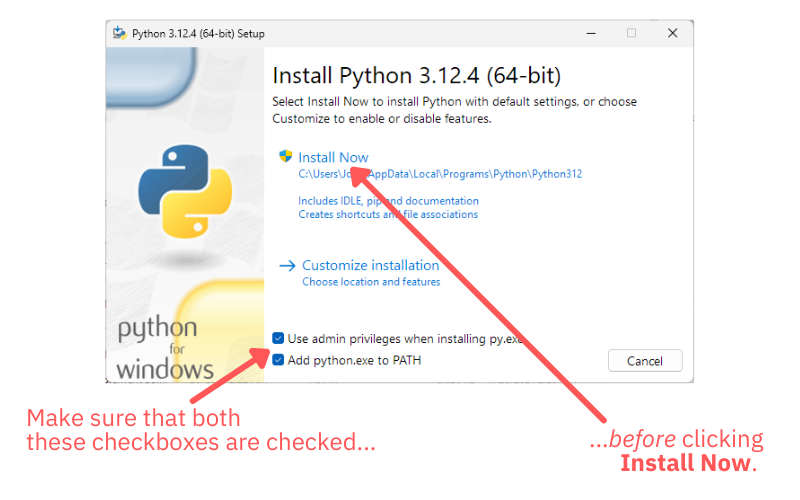
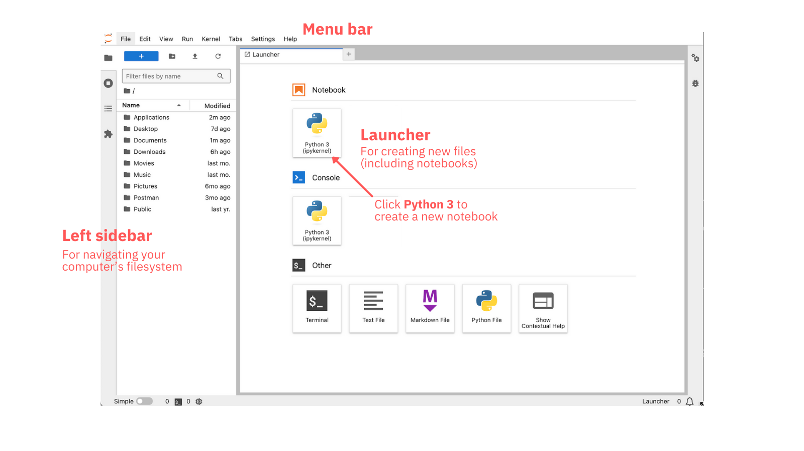
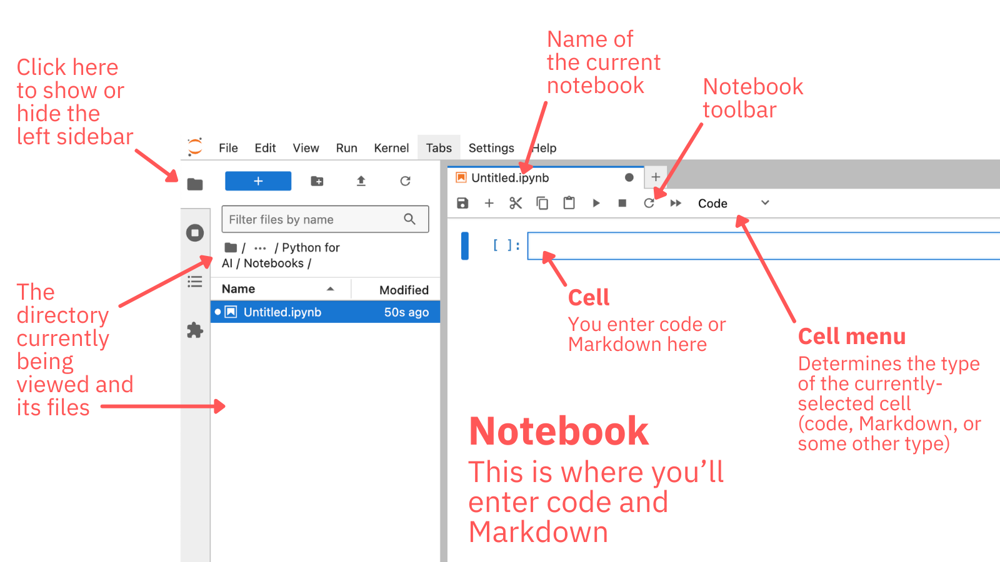
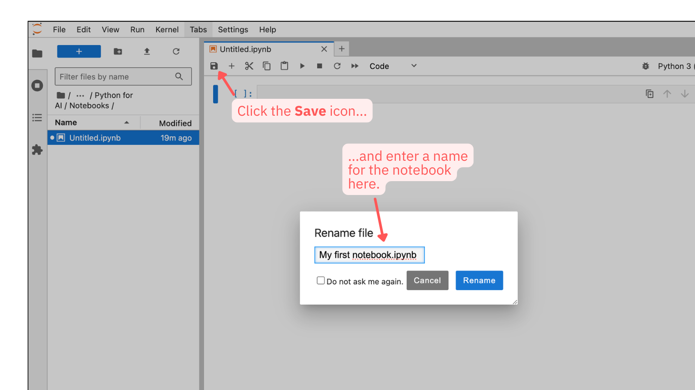
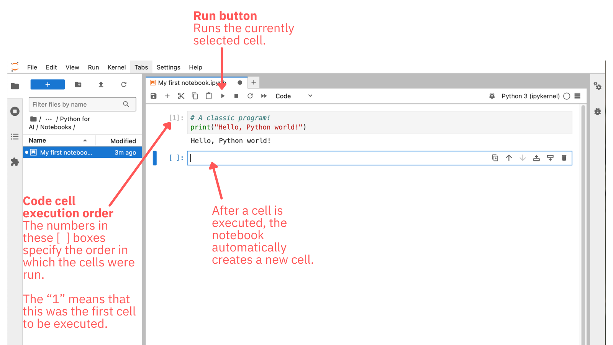
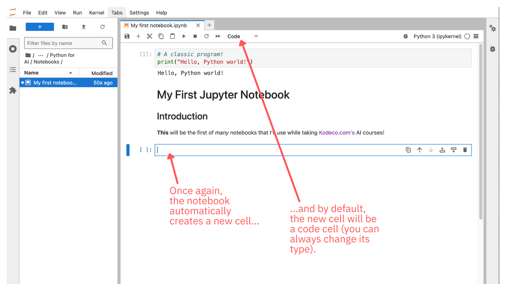

## Introducing Computational Notebooks and JupyterLab

### Computational Notebooks

Computational notebooks are interactive documents that combine code, text, and visual outputs in a single environment. They're widely used in data science, scientific computing, research, education, and more recently, artificial intelligence and machine learning.

Computational notebooks (which will be referred to as a “notebooks” from here onward) are organized into a series of cells. A notebook  is like a spreadsheet column whose cells can contain:

- **Code to be executed.** A cell can contain a code of arbitrary size and execute it. This code could just be a snippet, a function, a class, a module, or even a full application.
- **Rich media to be read, viewed, and listened to.** A cell can also contain text, static images, generated images and plots, media players, and interactive UI widgets.
- **System commands.** A cell can also contain shell commands, which are usually used to install packages and modules required by the code in the notebook.

You can think of them as documents that are enhanced by executable code, or executable code with a narrative and rich documentation.

The “column of cells” arrangement inside a notebook makes it possible to break large blocks of code into smaller units, right down to a single line of code per cell. Cells don’t have to be run in the order in which they appear; they can be run in any order, and they can be run more than once. This flexibility allows for a experimentation, revision, and rapid iteration.

Notebooks’ document format, with its support of rich text formatting and the ability to display results in-line with the code that produced them make them excellent data analysis tools _and_ documents for sharing data analysis results. 

Computational notebooks have become popular due to their flexibility and power in combining executable code with explanatory text and visualizations. They're particularly valuable in data-driven fields where exploration and explanation go hand in hand.

### JupyterLab

JupyterLab is a tool that builds upon Jupyter Notebook, an open source implementation of a computational notebook as a web application. JupyterLab provides a revised user interface and builds on and extends the functionality of Jupyter Notebook, while maintaining backward compatibility with Jupyter Notebook documents.

“Jupyter notebook” can be a confusing term, as it can refer to both the Jupyter Notebook application that JupyterLab evolved from, as well as the computational notebooks used by both JupyterLab and Jupyter Notebook. 

In this course, whenever there is a reference to a “Jupyter notebook,” it will be a reference to a computational notebook.


## Installing Python

The first step in this course is to install Python. 

Being an open source project, there are a number of Python distributions to choose from. This course will use what’s considered to be the official Python distribution from [python.org](https://www.python.org/), the official website for the Python programming language. 

> The official version of Python is also known as _CPython_. This name comes from the fact that it’s implemented in C and C++ (as are many other programming languages and operating systems).

### Installing Python on Windows

If you’re on Windows, the simplest way to install Python on your system i
s to use python.org’s Windows installer.

Go to [python.org](https://www.python.org/) and move your mouse over the **Downloads** menu bar item:



A pop-up should appear. It will have a button that you can click to download Python for Windows. Click that button to download the Python installer.

The installer will have the name like `python-3.12.x-amd64.exe`. By default, it should be downloaded to your _Downloads_ folder.

Double-click the installer to launch it. You should see this opening screen:



To avoid the problem where Windows can’t find Python, check these two checkboxes at the bottom of the installer’s opening screen:

- The **Use admin privileges when installing py.exe** checkbox
- The **Add python.exe to PATH** checkbox

Once you’ve checked those boxes, click the **Install Now** button to start the installation process.

Once the process completes, confirm that Python was properly installed on your computer. Do this by launching _PowerShell_ and then entering the following in _PowerShell’s_ command-line interface:

```
py --version
```

> If you’re not familiar with _PowerShell_, you can launch it by pressing Windows+r, entering `powershell` in the pop-up window that appears and clicking its **OK** button.

You should receive a single-line response immediately below the line where you entered `py --version` that looks something like this...

```
Python 3.12.y
```

...where `y` can be any number. If you get a response like this, Python has been installed on your computer and you can proceed to the next section, _Installing and Launching JupyterLab_.

### Installing Python on macOS

If you’re on macOS, the simplest way to install Python on your system is to use python.org’s macOS installer.

Go to [python.org](https://www.python.org/) and move your mouse over the **Downloads** menu bar item:


A pop-up should appear. It will have a button that you can click to download Python for Windows. Click that button to download the Python installer.

The macOS Python installer will have the name like `python-3.12.4-macos11.pkg`. By default, it should be downloaded to your *Downloads* folder.

Double-click the installer to launch it. You might see a window that says “‘Installer’ would like to access files on a removable volume.” If you see it, click the **Allow** button:


The installer will proceed to show you a few windows where you will need to click on buttons labeled **Continue**, **Agree**, and **Install**. Click these buttons as they appear until the installation begins.

Once the process completes, you should follow the instructions on the final screen of the installer:

> One more thing: to verify the identity of secure network connection, this Python needs a set of SSL root certificates. You can download and install a current curated set from the Certifi project by double-clicking on the Install Certificates icon in the Finder window. See the ReadMe file for more information.

Follow these instructions by opening the _Applications_ folder. Inside that folder, find the Python 3.12 folder and open it. You should see something like this:


Double-click the item named **Install Certificates.command**. It will open a Terminal window and run, displaying a stream of messages that should include something similar to following at or near the end:

```
Successfully installed certifi-202x.y.z
```

Finally, you should confirm that Python was properly installed on your computer. Do this by launching _Terminal_ and then entering the following in _Terminal’s_ command-line interface:

```
python3 --version
```

> If the above gives you an error, try entering `python --version` instead.

> If you’re not familiar with _Terminal_, you can launch it by pressing command+space to launch _Spotlight Search_, entering `terminal` in _Spotlight’s_ text field and pressing the **return** key.

You should receive a single-line response immediately below the line where you entered `python3 --version` or `python --version` that looks something like this...

```
Python 3.12.y
```

...where `y` can be any number. If you get a response like this, Python has been installed on your computer and you can proceed to the next section, _Installing and Launching JupyterLab_.

### Installing Python on Linux

There are so many distributions of Linux, each with its own idiosyncracies, that there isn’t enough space in this article to cover them all. You should search for instructions for installing or updating Python on your particular Linux system.

If you’re using Linux, you should first see if a recent-enough version of Python already exists on your system. Any version from 3.10 and later should suffice for this course and the ones that follow it.

Open a terminal and enter the following command to see if Python is on your system, and if so, which version it is:

```
python3 --version
```

> If the above gives you an error, try entering `python --version` instead.

You should receive a single-line response immediately below the line where you entered `py --version` that looks something like this...

```
Python 3.x.y
```

If the response is something like `Python 3.x.y` where `x` is `10` or greater, Python has been installed on your computer and you can proceed to the next section, _Installing and Launching JupyterLab_. 


## Installing and Launching JupyterLab

### Installing JupyterLab

The next step is to install JupyterLab, which you’ll do with pip, Python’s command-line package installer.

Install JupyterLab by running the following command on the command line (*Windows PowerShell* on Windows or *Terminal* on macOS and Linux):

```
pip install jupyterlab
```

> If you’re on macOS or Linux and the above command didn’t work, try replacing `pip` with `pip3`: `pip3 install jupyterlab`.

The installation process will generate a lot of messages. If it doesn’t end with an error message, your system is now properly set up for this course!

### Launching JupyterLab

To launch JupyterLab, enter the following command in your command-line interface:

```
jupyter lab
```

You’ll see a few messages appear on the command line, after which your default web browser will open a new tab or window that looks something like this:



This is the JupyterLab interface as it appears when first launched. You should see the following:

- At the top is the menu bar, where you’ll find often-used commands.
- The left sidebar is for navigating and managing your computer’s filesystem.
- Most of the space is taken up by the main work area, currently occupied by the Launcher, which gives you several options for creating new files.

It’s time to create your first notebook!

## Your First Notebook

To create a new notebook, click the **Python 3** button in the Launcher’s **Notebook** section. This will create a new notebook, which should look like this:



You’ll see that the Launcher has been replaced your newly-created notebook. The main work area is now occupied by the new notebook, which has the default filename `Untitled.ipynb`.

> `ipynb` is the filename extension for Jupyter notebooks. The name comes from the original name: “IPython Notebooks.”

By default, JupyterLab presents a tabbed interface similar to a browser’s, which allows for several notebooks to be open at the same time. As you continue developing notebooks, you may find that you have as many open notebook tabs as open browser tabs!

Before you start working with the notebook, save it.



Click the toolbar’s **Save** button. The **Rename file** pop-up will appear. Enter a new name for your notebook — if you can’t think of one, `My first notebook` will do — and click the **Rename** button.

It’s time to start coding!


### Code Cells

A new notebook starts with a single cell: a **code cell**, where you can enter and execute code.  which is a notebook cell that contains and can execute code. By default, Jupyter Notebook cells are code cells.

Enter the following code into the cell:

```python
# A classic program!
print("Hello, Python world!")
```

Run the code. You can do this by selecting the cell and either:

- Clicking the **Run** button in the menu bar, or
- Pressing **Shift-Enter** on your keyboard.

You should see “Hello, Python world!” appear immediately below the code cell, and your notebook should look like this:



When you run a code cell, the code in that cell executes, after which the notebook presents you with a new code cell.

As you’ve probably figured out:

- The `#` symbol starts single-line comments in Python, just as `//` starts single-line comments in many programming languages.
- Python has a `print()` function (similar to JavaScript’s `console.log()` or Java’s `System.out.println()`) that can be used to print messages to the console. In Jupyter, anything that is output to the console appear immediately after the code cell that generated that output.

### Markdown Cells

Now trying working on a **Markdown cell**, which is a notebook cell that contains and can render Markdown, a markup language for writing web content requires less typng than HTML.

> Introducing Markdown is beyond the scope of this lesson. If you’re new to Markdown, take a look at [GitHub’s guide to Markdown](https://docs.github.com/en/get-started/writing-on-github/getting-started-with-writing-and-formatting-on-github/basic-writing-and-formatting-syntax), [the interactive tutorial at markdowntutorial.com](https://www.markdowntutorial.com/), or [the markdown guide at markdownguide.org](https://www.markdownguide.org/).

Select the empty cell just below the cell where you entered code. You’ll need to change it from a code cell to a Markdown cell, which you do by selecting **Markdown** from the drop-down menu in Jupyter’s menu bar, then enter the following into the new Markdown cell:

```
# My First Jupyter Notebook

## Introduction
**This** will be the first of _many_ notebooks that I'll use while taking [Kodeco.com's](https://www.kodeco.com/) AI courses!
```

The notebook should now look like this:


Markdown cells render when you run them, so do that. As with code cells, you run a Markdown cell by selecting the cell and either:

- Clicking the **Run** button in the menu bar, or
- Pressing **Shift-Enter** on your keyboard.

The Markdown cell will render, and here’s what the notebook will look like:



Notebooks can have any combination of code and Markdown cells, and their size is limited only by your disk space.

Now that you’ve had your first exposure to notebooks, it’s time for an introduction to Python.


## Python’s Design Philosophy

### The Zen of Python

Enter the following into a code cell and run it:

```python
import this
```

Python’s `import` statement works like the `import` statement and other languages, such as JavaScript: it brings in functionality from external modules into the code.

`import this` is an exception — it’s an “Easter egg” rather than a command to import a module. It prints a poem called _The Zen of Python_, which lists the general guiding principles behind the design of the Python language.

Here’s the poem:

Beautiful is better than ugly.<br />
Explicit is better than implicit.<br />
Simple is better than complex.<br />
Complex is better than complicated.<br />
Flat is better than nested.<br />
Sparse is better than dense.<br />
Readability counts.<br />
Special cases aren't special enough to break the rules.<br />
Although practicality beats purity.<br />
Errors should never pass silently.<br />
Unless explicitly silenced.<br />
In the face of ambiguity, refuse the temptation to guess.<br />
There should be one-- and preferably only one --obvious way to do it.<br />
Although that way may not be obvious at first unless you're Dutch.<br />
Now is better than never.<br />
Although never is often better than *right* now.<br />
If the implementation is hard to explain, it's a bad idea.<br />
If the implementation is easy to explain, it may be a good idea.<br />
Namespaces are one honking great idea -- let's do more of those!

> The output of `import this` was written by [Tim Peters](https://en.wikipedia.org/wiki/Tim_Peters_(software_engineer)), one of the most notable contributors to the Python language and community. `import this` runs only once per Python session; subsequent attempts to run it will not display the poem.

_The Zen of Python_ is a pretty good summary of the “spirit” of the Python language and the programming style preferred by the Python community:

- **Readable:** There is an emphasis on clean, readable code. Python’s syntax is designed to be expressive, yet easy to understand, and Python developers are encouraged to write their code similarly.
- **Simple:** Sooner or later, you’ll hear a _Pythonista_ (a Python enthusiast) say this: “There should be one — and preferably *only* one — obvious way to do it.” Python and Python programmers aim to reduce complexity. Simple, easier-to-understand solutions are preferred over clever one that are obtuse and difficult to understand. Python also encourages simple, flat structures over deep hierarchies. 
- **Explicit:** Clear, explicit code is favored over implict behavior or hidden “magic.”
- **Consistent, but practically so:** Consistency is a core value of Python, but practical working solutions are prized over theoretical, pure, non-working ideas.
- **Fun:** Some programming languages are more fun to work in than others, and using Python is a lot of fun!

Keep _The Zen of Python_ in mind throughout this course. Understanding Python’s design philosophy will help you understand the language and learn it more quickly.

### Everything is an Object

One of the principles of Python’s design is that **everything is an object**:

- Data types: All data types, right down to integers, are objects, also known as class instances. As objects, they can have methods and properties.
- Functions: Functions are objects that can be assigned to variables, passed as arguments, returned from other functions, and can have methods and properties. Methods, being functions attached to a class, are also objects.
- Classes: Classes themselves are objects — they’re instances of a type called `type`.
- Modules: Imported modules are objects, too.

### Indentation Matters

## Data Types


### Numbers

Python supports three different number types: integers, floating-point numbers, and complex numbers.

#### Integers

`int` is Python’s integer type, which is used for performing whole-number arithmetic. The Python interpreter infers that any simple number *without* a decimal point is an integer. Some integer examples:

```python
8
-42
1024
```

Like many other programming languages, Python ignores the underscore (`_`) character in numbers, which makes it a useful separator to make numbers easier to read. For example, the following two integers — the number “ten million” — are equal:

```python
10000000
10_000_000
```

As of Python 3, there is no limit to the size of an `int` value. You can test this by running the following in a new code cell:

```python
999999999999999999999999999999999999999999999999999999999999999999999999999999999999999999999999 + 999999999999999999999999999999999999999999999999999999999999999999999999999999999999999999999999
```

#### Floating-point Numbers

`float` is Python’s type for floating-point numbers, or numbers with a decimal point. Python’s interpreter infers that any simple number *with* a decimal point — even a whole-number value like `1.0` — is a floating-point number. Some floating-point number examples:

```python
1.0
-9.81
12345.67890
```

Python supports _exponential notation_ for representing very large and very small floating point numbers. For example, here is how you would represent [Avogadro’s number](https://en.wikipedia.org/wiki/Avogadro_constant) (6.023 × 10<sup>23</sup>) in exponential notation:

```python
6.023e23
```

Here’s a very small number expressed in exponential notation — the mass of an electron in kilograms (9.109383 × 10<sup>-31</sup>):

```python
9.109_383e-31
```

Note that you can use underscores as separators in floating-point numbers, just as you can with integers.

Python uses 64-bit double-precision values to represent floating-point numbers, which is the equivalent of the `double` type in many other programming languages. This means that a Python `float` can represent numbers as large as approximately ±1.798 × 10<sup>308</sup> and as small as ±2.22 × 10<sup>-308</sup>.

> To get a sense of how large a number a `float` can represent — on the order of 10<sup>308</sup> — consider that the estimated number of atoms in the known universe is about 10<sup>80</sup>.


#### Complex Numbers

Python come with built-in support for [complex numbers](https://en.wikipedia.org/wiki/Complex_number) with the `complex` data type. Here is how the complex number _2 + 3i_ is represented in Python:

```python
2+3j
```

Note that Python uses the letter _j_ to denote the imaginary part instead of the letter _i_. This is a convention borrowed from electrical engineering, where _i_ is already used to represent current. 


### Strings

`str` is Python’s type for string values. Like many other programming languages, Python string literals begin and end with single- (`'`) or double-quote (`"`) characters. For example:

```python
"This is a Python string."
'This is also a Python string.'
```

Python also supports multi-line strings, which begin and end with three single-quote (`'''`) or three double-quote (`"""`) characters in a row. For example:

```python
"""This is just to say
that this is
a Python multi-line string."""
'''This is also
a Python multi-line string.'''
```

> While Python supports both single- and double-quotes to denote strings, this course will follow the convention enforced by the Black code formatter and use only double-quotes.

### Booleans

`bool` is Python’s type for boolean values, which can be one of the following:

1. `True`
2. `False`

Note that unlike most programming languages, the boolean values `True` and `False` are capitalized. The all-lowercase `true` and `false` used in most other programming languages are undefined in Python.

#### Comparison and Boolean Operators

While you will sometimes directly set the value of a variable to `True` and `False`, you will more often create boolean expressions using comparison operators.

Python uses the standard comparison operators found in other programming languages, and using them produces results that are either `True` or `False`:

- `==`: Equal to
- `!=`: Not equal to
- `>`: Greater than
- `<`: Less than
- `>=`: Greater than or equal to
- `<=`: Less than or equal to

You will often create more complex boolean expressions using logical “and,” “or,” and “not.” In keeping with its philosophy of readability, Python _doesn’t_ use `&&`, `||`, and `!` — its boolean operators are the actual words `and`, `or`, and `not`!

> Even though Python uses `not` instead of `!`, it still uses the `!=` operator to mean “not equal to” because it fits with Python’s other philosophy of conciseness.

Run each of the following in a code cell to see the result:

- 2 + 3 == 5  # True
- 4 != 5  # True
- 5 != 5  # False
- 5 > 6  # False
- 2 + 3 == 5 and 4 != 5  # True; a little hard to read
- (2 + 3 == 5) and (4 != 5)  # True; more readable
- (2 + 3 == 5 and 5 != 5  # False
- (4 != 5) or (5 != 5)  # True
- (5 != 5) or (5 > 6)  # False
- not 5 > 6  # True
- not 6 > 5  # False
- not 4 == 5  # True; != would have been more concise

### `None` of the Above

Python’s `None` — note that it’s capitalized, like the boolean values `True` and `False` — is a special constant that represents a null value or the absence of a value, like `nil` or `null` in other programming languages.

One common use of `None` is to initialize variables that will be assigned a value at a later time. This is as close to declaring a variable as Python gets:

```python
# The game hasn’t started yet
player_current_level = None
```

### Determining a value’s type

Python’s `type()` function takes an object and returns that object’s type. 

Run each of the following in a code cell to see the result:

- `type(2)`
- `type(3.14159)`
- `type(4+5j)`
- `type("Testing one, two, three")`
- `type(False)`
- `type(None)`

The results should be `int`, `float`, `complex`, `str`, `bool`, and `NoneType`, which are the classes for the integer, floating-point number, complex number, string, and boolean types.

### Converting Values to Other Types

If there is a reasonable equivalent, it’s possible to convert a value from one type to another. In many other programming languages, this is called _casting_, but in Python, it’s more accurate to call it type _conversion_.

Suppose you wanted to convert the string `"5"` into its numeric equivalent. If you wanted to turn it into an integer, you’d do this:

```python
int("5")
```

The code above produces the number 5, which will be output just below the code cell.

Because `"5"` is the string version of an integer, it’s possible to convert it from a string to an integer. On the other hand, this will fail:

```python
int("spam")
```

The code above results in an error, and Jupyter will display a red-tinted area below the code cell ending with the message “ValueError: invalid literal for int() with base 10: 'spam'.”

If you needed to convert the `"5"` into a floating-point number, that can be done using `float()`:

```python
float("5")
```

Because `"5"` can be converted into a floating-point number, the code above results in the number 5.0, which will be output just below the code cell.

You can use any of the type constructors to convert a value to that type:

- `int()` to convert to an integer
- `float()` to convert to a floating-point number
- `complex()` to convert to a complex number
- `str()` to convert to a string
- `bool()` to convert to a boolean


## Variables and (No) Constants

Like most high-level programming languages, Python has _variables_, which you can think of as named containers that store values. As the term “variable” implies, the value contained within a variable can be changed during runtime.

### Creating Variables

Python doesn’t have keywords like `var` or `let` for declaring variables. Instead, variables are created by assigning an initial value to an _identifier_ (the computer science term for “name”) using `=`, the assignment operator.

Here are some examples showing how variables are created:

```python
# Creating an integer variable
score = 200

# Creating a floating-point variable
time_travel_gigawatts = 1.21

# Creating a string variable
greeting = "Welcome to Python"

# Creating a boolean variable
is_user_logged_in = True
```

Python does _not_ require you to specify the variable’s type. Instead, it infers the variable’s type from the value assigned to it.

### Naming Variables

There are two sets of rules for naming variables in Python:

1. The Python language rules, which define valid names for variables.
2. The Python community’s conventions, which are guidelines that are generally observed by Python programmers to make their code easier to read.

#### Variable Naming Rules

Python’s rules for _identifiers_ — names for things in code, which include variables — are similar to those for most other programming languages.

Every identifier must:

1. Start with a letter or underscore (`_`) character.
2. Continue with any combination of letters, digits, and underscores.
3. Not be one of the identifiers used by the Python language, which are called _reserved words_ or _keywords_.

In the rules listed above, the term “letter” is being used to refer to any character that is used to form a word in natural language. These characters include:

- The uppercase and lowercase versions of the letters A through Z, which make up the basic Latin alphabet used by English and many European languages.
- The extended Latin alphabet, which includes characters with accents and other marks, such as ä, æ, ç, é, î, ñ, ö, ž, and more.
- Other alphabets including Arabic, Armenian, Bengali, Chinese, Cyrillic, Devanagari, Ethopic, Georgian, Greek, Hangul, Hebrew, Japanese (Hiragana and Katakana), Khmer, Lao, Myanmar, Tamil, Thai, and more.

> Python does not support emoji in identifiers by default. If you really want emoji in your variable names, the [_pythonji_](https://pypi.org/project/pythonji/) library makes it possible.

Fortunately for programmers who have to come up with names for variables, Python’s set of reserved words is small:

```
False      await      else       import     pass
None       break      except     in         raise
True       class      finally    is         return
and        continue   for        lambda     try
as         def        from       nonlocal   while
assert     del        global     not        with
async      elif       if         or         yield
```

Spaces cannot be used in identifiers. Python treats spaces as separators for words, so a variable name like `high score` would be interpreted as two indentifiers in a row.

With these rules in mind, the following are valid variable names in Python:

```python
i
temperature
spending_limit
rotationSpeed
Counter
Counter2
_students   
résumé  # Note the accents
结果. # “result” in Chinese
```

As with most other languages, variable names are case sensitive. For example, Python treats the variables `score` and `Score` and two different things:

```python
score = 5
Score = 10

print(score) # prints 5
print(Score) # prints 10
```

#### Variable Naming Conventions

The Python programming community generally agrees that one of the most important qualities of code is readability. To that end, they have come up a set of rules for naming variables that most Python programmers follow.

The general rule is that variable names must use only lowercase characters, using underscores to separate words if the variable is made of multiple words. Here are some examples:

```python
limit
spending_limit
special_case_spending_limit
```

This style of name is called _snake case_. The term refers to the way the mix of characters and underscores resembles the shape of snake slithering as it moves. Snake case is intended to enhance readability and consistency, especially in languages like Python, where whitespace matters (more on this later).

The rise of data science and the current wave of machine learning and AI have boosted Python’s popularity, which has brought an influx of new programmers, many of whom have come from other programming languages where _camel case_ (which makes identifiers look like a camel’s humps) is the style for naming variables. Here are some examples:

Don’t use these!

- `limit`
- `spendingLimit`
- `specialCaseSpendingLimit`

It is strongly recommended that you follow the snake case naming convention for variables, as well as other idioms and stylistic conventions followed by the Python community.


### (No) Constants

Unlike many high-level programming languages, Python _does not_ have constants — just variables.

To make up for a lack of constants, many Python programmers follow the convention of naming them using only uppercase letters with underscore characters (`_`) separating words to make their names more readable. For example:

```python
LIVES_PER_GAME = 3
AVOGADRO_NUMBER = 6.023e+23
```

Giving a variable an all-uppercase name does _not_ prevent code from modifying its contents during runtime. It simply suggests to other programmers that they shouldn’t change its value once it’s been created.

### Deleting Variables

Unlike most languages, Python has a statement that deletes objects from memory, which includes variables: `del`.

To see `del` in action, run the following code in a new code cell:

```python
my_variable = "I won't be around for long."
print(my_variable)
del my_variable
print(my_variable)  # "NameError: name 'my_variable' is not defined"
```

After the `del my_variable` line executes, `my_variable` no longer exists. Any subsequent reference to `my_variable`, such as the the line that follows, results in an error.

Notice that `del` is a statement, not a function. You don’t need to put parentheses around the variable to be deleted.


## Getting User Input with `input()`

Python’s `input()` function was originally designed for a time when Python programs were strictly for the command line. It presents the user with an optional prompt and waits for them to enter something and returns the user’s input as a string. In Jupyter, it presents the prompt beside a text box where the user can enter text.

Enter the following into a code cell and run it:

```python
# Putting a space at the end of an `input()` prompt
# provides a little distance between the prompt
# and the text input box.
name = input("What is your name? ")
print(name)
```

It will present you with the prompt “What is your name?” and a text box beside it. After you enter something into text box, it will print your input text on the following line.

Remember that `input()` returns a string. If your program asks for numeric input, remember to convert `input()`’s result with `int()` or `float()`.


## String Interpolation with f-strings

One of the most useful tools for presenting text data to users is _string interpolation_, which is the embedding of variable and expression values directly into a string. In Python, this is done using _f-strings_ (where “f” stands for “formatted string literal”), which are string literals with a lowercase `f` before the opening quote.

Run the following in a code cell below to see f-strings in action:

```python
name = input("What is your name? ")
print(f"That’s funny, my dog's name is {name}.")
```

In an f-string, the content of anything in braces (the `{` and `}` characters) is evaluated, converted to its string representation, and included in the string.

Multi-line strings can be f-strings. Enter the following in a code cell and run it:

```python
food = input("Enter a food you like (e.g. 'plums', 'potato chips'): ")
container = input("Enter a kind of container (e.g. 'icebox', 'vault'): ")
occasion = input("Enter an occasion (e.g. 'breakfast', 'national cat day'): ")
flavor = input("Enter a taste (e.g. 'sweet', 'acidic'): ")

print(f"""I have eaten
the {food}
that were in
the {container}

and which
you were probably
saving
for {occasion}

Forgive me
they were delicious
so {flavor}
and so cold""")
```


## Branching With `if`, `elif`, and `else`

### `if` and Indentation

Python’s `if` statement works as you might expect, but the differences in syntax from other programming languages are significant enough to give it a closer look.

Run this code in a new code cell a couple of times. See what happens when you enter `y` in response to the `input()` prompt, and what happens when you enter anything else.

```python
status = input("Is the job complete? Enter 'y' if the answer is 'yes'. ")

if status == "y":
	print("Hooray! The job is complete!")
	print("Take a moment to celebrate.")
	print("But afterward, get back to work!")
print("Now on to the rest of the program.")
```

#### Test Expressions Don’t Need Parentheses

Take a closer look at the `if` statement:

```python
if status == "y":
```

The first thing you should notice is that the expression following `if` is _not_ in parentheses. In many other languages, the line would be written this way:

```javascript
// This is how it's done in JavaScript and other languages
// that borrow their syntax from C:
if (status == y) {
```

Python doesn't require parentheses around an `if` statement’s test expression. It’s part of the Python philosophy of readability and simplicity.

You can still use parentheses in the test expression. The following code will work...

```python
if (status == "y"):
```

...but it’s not typical. Most Python programmers use parentheses in their `if` test conditions only when it makes the code easier to read.

> In keeping with Python convention, the Black code formatter will remove the parentheses from `if (status == "y"):`.

#### Code Blocks Begin With `:` and Are Indented

Here’s the entire `if` section of the code:

```python
if status == "y":
	print("Hooray! The job is complete!")
	print("Take a moment to celebrate.")
	print("But afterward, get back to work!")
```

The `if` statement, `if status == "y":`, ends with the colon (`:`) character. This character is a very important one in Python, since it says the following:

- A block of code, made up of the following indented lines, starts below.
- The code block will execute if and only if the conditions on this line are met. In this case, there’s just one condition: `if status == "y"`.

These indented lines make up the code block, which executes if and only if `status` contains `y`:

```python
	print("Hooray! The job is complete!")
	print("Take a moment to celebrate.")
	print("But afterward, get back to work!")
```

You can include blank lines within indentation; Python will ignore them. For example, Python considers the following code to be all part of the same block, even though there’s a gap between lines:

```python
	print("Hooray! The job is complete!")
	
	print("Take a moment to celebrate.")
	
	print("But afterward, get back to work!")
```

The end of the `if` block is indicated by the end of the indentation. In this example, this line of code is _outside_ the `if` block and executes regardless of whether `status` contains `y` or not:

```python
print("Now on to the rest of the program.")
```

#### The Idea Behind Indentation

In many other programming languages, the `if` statement and the code following it would look something like this:

```javascript
// This is how it's done in JavaScript and other languages
// that borrow their syntax from C.
// (Assume that the print() function works in the same way
// as in Python.)

if (status == "y") {
	print("Hooray! The job is complete!");
	print("Take a moment to celebrate.");
	print("But afterward, get back to work!");
}
print("Now on to the rest of the program.");
```

In these languages, blocks are indicated by using both braces (the `{` and `}` characters, also called “curly brackets”) and indentation, which are for the benefit of two distinct entities:

- The braces mark the beginning and the end of the block for the benefit of the _programming language compiler or interpreter_. The compiler or interpreter ignores any kind of extra whitespace, including indentation.
- The indentation marks the beginning and the end of the block for the benefit of the _humans reading or writing the code_. Humans often miss or ignore braces, which is why we came up with the convention of indenting code blocks.

The Python approach of using indentation to denote code blocks means that indentation isn’t just a convention, but a feature of the language. Indentation has meaning to both the the programming language and programmers; it says “this is a block of code, which should be executed only under specific conditions.”

The next few sections in this lesson will cover other Python constructs that make use of the Python syntax where `:` denotes the start of a block and indentation indicates which lines are in the block.

### `else`

If you take Python’s syntax into account, the `else` keyword works as you might expect. Enter the following into a new code cell and run it. 

Enter anything other than `y` to cause the code in the `else` block to execute:

```python
status = input("Is the job complete? Enter 'y' if the answer is 'yes'. ")

if status == "y":
	print("Hooray! The job is complete!")
	print("Take a moment to celebrate.")
	print("But afterward, get back to work!")
else:
	print("Well, keep working at it.")
	print("We'll celebrate when it's done.")

print("Now on to the rest of the program.")
```

In this version of the code, there are now two specific responses to the user’s input:

- One when the user enters `y`, which causes the code block after the `if` statement to execute. The code block ends when the indentation ends: at the `else` statement.
- One when the user enters anything other than `y`, which causes the code block after the `else` statement to execute. The code block ends when the indentation ends.

After either case, the code proceeds to the next line - `print("Now on to the rest of the program.")` — which is at the same level of indentation as the `if` and `else` statements. This line will execute, regardless of whether the user entered `y` or not.

### `elif`

Python has the `elif` keyword for cases where branching can lead to more than two possible outcomes. It’s a compressed, combined version of the `else if` statement that other programming languages have.

Run this code in a new code cell a couple of times. See what happens when you enter `y`, `n`, or anything else in response to the `input()` prompt:

```python
status = input("Is the job complete? Enter 'y' or 'n'. ")

if status == "y":
	print("Hooray! The job is complete!")
	print("Take a moment to celebrate.")
	print("But afterward, get back to work!")
elif status == "n":
	print("Well, keep working at it.")
	print("We'll celebrate when it's done.")
else:
    print("You're not good at following instructions.")
    print("This will go in your permanent record.")

print("Now on to the rest of the program.")
```

In this code, there are now _three_ responses to the user’s input:

- One when the user enters `y`, which causes the code block after the `if` statement to execute. The code block ends when the indentation ends: at the `elif` statement.
- Another one when the user enters `n`, which causes the code block after the `elif` statement to be executed. The code block ends when the indentation ends: at the `else` statement.
- A final one when the user enters anything other than `y` or `n`, which causes the code block after the `else` statement to execute. The code block ends when the indentation ends.

After all of these cases, the code proceeds to the next line - `print("Now on to the rest of the program.")` — which is at the same level of indentation as the `if`, `elif`, and `else` statements. This line will execute, regardless of what the user entered.


## `while` Loops

In keeping with Python’s spirit of simplicity, Python has only two kinds of loops, the first of which is the `while` loop. It functions like the `while` loops in most other programming languages.

Run the following in a new code cell:

```python
count = 0
while count < 5:
    print(f"The current count is {count}.")
    count += 1
```

Note that you don’t have to put the conditional expression — the `count < 5` part — in parentheses, just as they’re not required in Python’s `if` and `elif` statements. This makes sense; like `if` and `elif`, loops are a form of branching.

Like other programming languages, you can use the `break` statement to prematurely enter a loop. Run the code below in a code cell to see `break` in action:


```python
while True:
    response = input("Continue? Enter \"y\" or \"n\". ")
    if response == "y" or response == "n":
        break
print(f"Your response was \"{response}\".")
```

Python also provides the `continue` statement, which takes control back to the start of the loop, where the conditional expression that comes after `while` is evaluted again. Run the following in a new code cell to see `continue` in action:

```python
count = 0

while count < 20:
    count += 1
    if count % 3 == 0:
        continue
    print(f"The current number is {count},")
    print("and it's not evenly divisible by 3.")
```


## Lists

What most other programming languages have _arrays_, Python provides _lists_. Python lists come with a lot of functionality, some of which will be covered below.

Like arrays in other languages, Python’s lists are indexed, ordered collections of items, and they use the same syntax. Also like arrays in other languages, Python list literals are a series of items separated by commas and surrounded by square brackets, as shown below:

```python
["first", "second", "third"]
```

### Creating an Empty List

The simplest way to create an empty list is to assign an empty list literal to a variable:

```python
empty_list = []
```

You can confirm the list’s type with the `type()` function:

```python
type(empty_list)  # list
```

You can also create a list using object initialization syntax (there’ll be more on Python’s classes and objects in Lesson 2):

```python
another_empty_list = list()
```

### Creating a List With Items

Here’s how you would create and view a list of the [most popular ice cream flavors in the U.S.](https://whatsupnewp.com/2023/05/the-21-most-popular-ice-cream-flavors-in-america/):

```python
# A list of the five most popular ice cream flavors in the US
flavors = ["vanilla", "chocolate", "cookies and cream", "strawberry", "chocolate chip"]
flavors
```

Unlike arrays in many other languages, items in Python lists don’t have to the same type. The following is a perfectly valid list:

```python
hodgepodge = [1, 2.3, 4+5j, "six", True, [7, 8, 9]]
```

The list above contains these data types, listed in the order of their appearance: integer, floating-point number, complex number, string, boolean, and list.

The remainder of the code examples in this section will be based on the `flavors` list. Follow along by entering each code example into a new code cell.

### Accessing List Items

You access individual items in a list using the same _array notation_ as other programming languages, with the name of the list, followed by index of the item in square brackets (`[` and `]`), where the first item’s index is 0.

Run the following code snippets in their own code cells:

```python
# Retrieve the item at index 0 — the first item in the list
flavors[0] # "vanilla"
```

```python
# Retrieve the item at index 3 — the fourth item in the list
flavors[3]  # "strawberry"
```

### Updating List Items

You update items in a list in the same way as other languages: using index notation and the assignment operator, `=`. 

Run the following in a code cell:

```python
# Update the item at index 2 (3rd item in the list)
flavors[2] = "butter pecan"
flavors
```

As with arrays in other programming languages, trying to access an item with an “out of bounds” index results in an error:

```python
# This results in an error with the message:
# "IndexError: list index out of range"
flavors[8]
```

### Number of Items in a List

In many other programming languages, arrays have a property or method called `size`, `length`, or `count` to report the number of items they contain. In Python, you get the number of items in a list by using the `len()` function:

```python
# How many flavors in the list?
len(flavors)  # 5
```

### Accessing the Last (Or Second-Last, or Third-Last...) Items in a List

In many other programming languages, it takes a little extra work to access the last item in an array, or the second-last, or the third-last, and so on.

Run the following code snippets in their own code cells:

```python
# Get the last item in the list, the clunky way
flavors[len(flavors) - 1]
```

```python
# Get the second-last item in the list, the clunky way
flavors[len(flavors) - 2]
```

Python lets you use _negative indexes_, where `-1` is the index for the last item in the list, `-2` is the index for the second-last item, `-3` for the third-last, and so on.

Run the following code snippets in their own code cells:

```python
# Get the last item in the list, the clunky way
flavors[len(flavors) - 1]  # "chocolate chip"
```

```python
# Get the second-last item in the list, the clunky way
flavors[len(flavors) - 2]  # "strawberry"
```

As with positive indexes, trying to access an item with an “out of bounds” negative index results in an error:

```python
# This results in an error with the message:
# "IndexError: list index out of range"
flavors[-8]
```

### Adding an Item to the End of a List

The `append()` method takes an item and adds it to the end of the list.

```python
# Add a new flavor — “pistachio” — to the end of the list.
flavors.append("pistachio")
flavors
```

If you’ve been running the list examples in code cells from the start, `flavors` should now contain:

```
['vanilla',
 'chocolate',
 'butter pecan',
 'strawberry',
 'chocolate chip',
 'pistachio']
```

### Adding an Item at a Specific Position in a List

The `insert()` method takes two values:

1. The index where the new item should be added.
2. The item to be added.

```python
# Add a new flavor — "cake batter" — at index 2.
flavors.insert(2, "cake batter")
flavors
```

Note that inserting an item into a specific position in a list moves the item originally at that location — and all the items that follow it — one position over in the list.

If you’ve been running the list examples in code cells from the start, `flavors` would look like this before adding "cake batter" at index 2...

```
['vanilla',
 'chocolate',
 'butter pecan',
 'strawberry',
 'chocolate chip',
 'pistachio']
```

...and here’s what it would look like after:

```
['vanilla',
 'chocolate',
 'cake batter',
 'butter pecan',
 'strawberry',
 'chocolate chip',
 'pistachio']
```

### Removing the Last Item From a List

The `pop()` method removes the last item from the list _and_ returns that item.

```python
# Remove the last item from the list
# and capture it in the variable `popped_flavor`.
popped_flavor = flavors.pop()
flavors
```

If you’ve been running the list examples in code cells from the start, `flavors` would look like this after running the code above:

```
['vanilla',
 'chocolate',
 'cake batter',
 'butter pecan',
 'strawberry',
 'chocolate chip']
```

The item that was just removed is contained in the variable `popped_flavor`, which captured the `pop()` method’s return value:

```python
popped_flavor  # "pistachio"
```

If you don’t need the popped item, you can simply ignore `pop()`’s return value:

```python
flavors.pop()
```

If you run the code above in a code cell, you’ll see the flavor that `pop()` just removed because Jupyter displays the result of the last thing it executed. But that value is “lost” since it was never captured in a variable.

### Removing an Item From a List Based on Its Index With `pop()`

The `pop()` method can also remove an item from a given position in the list. If you pass it an index, `pop()` removes the list item at that index and returns that item.

```python
# Remove the item at index 2 from the list
# and capture it in the variable `popped_flavor`.
popped_flavor = flavors.pop(2)  # "cake batter"
```

If you’ve been running the list examples in code cells from the start, `flavors` would look like this before removing the item at index 2...

```
['vanilla', 
 'chocolate', 
 'cake batter', 
 'butter pecan', 
 'strawberry']
```

...and here’s what it would look like after:

```
['vanilla', 
 'chocolate', 
 'butter pecan', 
 'strawberry']
 ```

Just like the version of `pop()` where you don’t provide an index, you can either capture or ignore its return value.

### Removing an Item From a List Based on Its Index With `del`

The `del` statement, which was covered at the end of the section on variables, is Python’s all-purpose remover of objects, which includes array items. R

Enter the following in a code cell and run it to see `del` in action:

```python
# Redefine flavors so that there' a flavor to `del`
flavors = ["vanilla",  "chocolate",  "rocky road", "butter pecan", "strawberry"]
print(flavors)
del flavors[2]
print(flavors) 
```

Remember, `del` is _not_ a list method. It’s not even a function! It’s a _statement_ — a standalone command that performs a task. You don’t need to put parentheses around the list item that you want to delete.

### Removing an Item From a List Based on Its Value With `remove()`

Not only can you remove an item from a list based on its _position_ (its index), but you can also remove an item based on its _value_ with the `remove()` method. Given an item, `remove()` removes the first instance of that item from the list.

Run the following in a code cell to how `remove()` works:

```python
# Redefine flavors so that there' a flavor to `remove()`
# Note that there’s a duplicate "chocolate"
flavors = ["vanilla",  "chocolate",  "chocolate", "butter pecan", "strawberry"]
print(f"Before:\n{flavors}")
flavors.remove("chocolate")
print(f"After:\n{flavors}") 
```

Unlike `pop()`, `remove()` doesn’t have a return value, but it doesn’t need to: you already know which value you removed from the list, because you asked to remove the first instance of that value!

Any attempt to `remove()` a value that doesn’t appear in the list results in an error:

```python
flavors.remove("bubble gum")  # ValueError: list.remove(x): x not in list
```

### Moving an Item in a List From Position _x_ to Position _y_

There isn’t a built-in Python command to move an item within a list, but you can do this with a `pop()` followed by an `insert()`.

To move a flavor from index 1 to index 3, `pop()` the item at index 1 while capturing its value, and then `insert()` that insert it at index 3.

```python
# Pop (and capture) the item at index 1
flavor = flavors.pop(1)
# Insert the popped flavor into index 3
flavors.insert(3, flavor)
# Let’s get a look at the new list
flavors
```

You can do it in one line by using the `pop()` result as the second argument for `insert()`:

```python
# Move the flavor at index 2 to index 0
flavors.insert(0, flavors.pop(2))
```

If you’ve been running the list examples in code cells from the start, `flavors` would look like this now:

```
['strawberry', 
 'vanilla', 
 'butter pecan', 
 'chocolate']
```

### Determining if a Given Item Is in a List

There are a couple of ways to determine if a given item is in a list.

The `in` operator provides the most straightforward way, returning `True` if the given item is in the list, and `False` otherwise:

```python
# Is “vanilla” is the list?
"vanilla" in flavors  # True
```

### Number of Instances of an Item in a List 

The `count()` method, given an item, returns the number of times that item appears in the list. If the given item _doesn’t_ appear in the list, `count()` returns 0.

Assuming that `flavors` currently has these values...

```
['strawberry', 
 'vanilla', 
 'butter pecan', 
 'chocolate']
```

...first add another "vanilla" to the list:

```python
# Add one more "vanilla" to the end of the list
flavors.append("vanilla")
```

Try getting a `count()` of "vanilla" instances in the list:

```python
# How many times does "vanilla" appear in the list?
flavors.count("vanilla")  # 2
```

Now try getting a `count()` of "bubble gum" — a flavor that _isn’t_ in the list:

```python
# How many times does "bubble gum" appear in the list?
flavors.count("bubble gum")  # 0
```

`count()` provides another, more roundabout way of determining if a given item is in a list. If it returns 0, the item is not in the list. If it returns a value greater than 0, there is at least one instance of that item in the list.


### Finding the First Instance of an Item in a List

The `index()` method, returns the location the first instance of a given item in a list — but only if it’s actually in the list.

Assuming that `flavors` currently has these values...

```
['strawberry', 
 'vanilla', 
 'butter pecan', 
 'chocolate', 
 'vanilla']
```

...here’s how you would find the first instance of “butter pecan” in the list:

```python
# Where is "butter pecan" in the list?
flavors.index("butter pecan")  # 2
```

If the list _doesn’t_ contain the item you’re looking for, using `index()` to find that item results in an error.

```python
# Where is “bubble gum” in the list?
# (Hint: It’s not in the list)
flavors.index("bubble gum")  # ValueError
```

One way around this problem is to use `in` to test that the item you’re looking for is actually in the list before trying to find where it is in the list:

```python
# Find out where “bubble gum” is in the list,
# but only if it’s actually in the list.
if "bubble gum" in flavors:
    print(f"The first bubble gum is at position {flavors.index("bubble gum")}.")
else:
    print("No bubble gum!")
```

Another way is to use `count()`:

```python
# Another way to do it
if flavors.count("bubble gum"):
    print(f"The first bubble gum is at position {flavors.index("bubble gum")}.")
else:
    print("No bubble gum!")
```

### Removing an Item From a List Based on Its Value

Use the `remove()` method to specify the value of the item you want to remove. If there’s more than one instance of the first value, then `remove()` will remove only the first instance.

```python
# Remove "strawberry" from the list
flavors.remove("strawberry")
flavors
```

If the list _doesn’t_ contain the item you’re trying to remove, using `remove()` to remove that item results in an error.

```python
# Remove "bubble gum" from the list
# (It’s not in the list)
flavors.remove("bubble gum")  # ValueError
```

You can use `in` or `count()` to check for a value before trying to use `remove()` to remove it:

```python
# Using `in` to check for an item's presence
# before removing it
if "bubble gum" in flavors:
    flavors.remove("bubble gum")
    
# Using `count()` to check for an item's presence
# before removing it
if flavors.count("bubble gum"):
	flavors.remove("bubble gum")
```

### Removing All Items From a List

The `clear()` method removes all items from a list:

```python
sauces = ["chocolate", "caramel", "marshmallow", "strawberry"]
sauces.clear()
sauces
```

### Sorting a List

Use the `sort()` method to sort the elements in a list. `sort()` sorts the list _in place_; that is, it doesn’t create a sorted copy of the list, but rearranges its items in sorted order.

Here’s how you sort the list in ascending order:

```python
# Sort the flavors in ascending order.
flavors.sort()
flavors
```

If you’ve been running the list examples in code cells from the start, `flavors` would look like this now:

```
['butter pecan', 
 'chocolate', 
 'vanilla', 
 'vanilla']
```

To sort the list in descending order, set `sort()`’s `reverse` parameter to `True`:

```python
flavors.sort(reverse=True)
flavors
```

`flavors` should now look like this:

```
['vanilla', 
 'vanilla', 
 'chocolate', 
 'butter pecan']
```

### Reversing the Order of a List

Use the `reverse()` method to reverse the order of a list. Like `sort()`, `reverse()` reverses the order of the list in place.

```python
# Reverse the order of the list
flavors.reverse()
flavors
```

### Creating a Sorted Copy of a List

Python has a _function_ called `sorted()`, It’s not a list method; it’s one of Python’s built-in functions. Unlike the `sort()` method, `sorted()` _doesn’t_ sort the list in place. Instead, it returns a new list: a sorted copy of the original.

If you’ve been running the list examples in code cells from the start, `flavors` should currently be in sorted order. Reverse it before creating a sorted copy:


```python
# Reverse flavors, then create a sorted copy
# called `sorted_flavors`
flavors.reverse()
sorted_flavors = sorted(flavors)
print(f"flavors:\n{flavors}")
print(f"sorted_flavors:\n{sorted_flavors}")
```

### Merging Two Lists

There are many ways to merge two lists in Python.

One of these ways is to use the `+` operator. The result is a new list made of the items in the first list in the order in which they appear, followed by the items in the second list in the first list in the order in which they appear:

```python
# Merging lists with +
lots_of_flavors = flavors + sorted_flavors
lots_of_flavors
```

Another way is to use the `extend()` method, which you call as a method of the first list, and pass the second list as a parameter. This changes the first list, which now contains the items in the first list in the order in which they appear, followed by the items in the second list in the first list in the order in which they appear:

```python
# Merging lists with `extend()`
flavors.extend(sorted_flavors)
print(f"flavors:\n{flavors}")
print(f"sorted_flavors:\n{sorted_flavors}")
```

## Tuples

Tuples are indexed, ordered sequences that immutable, and you can think of them as “immutable lists.” 

Tuple literals look like list literals, except that they’re surrounded by parentheses instead of square brackets, as shown below:

```python
("first", "second", "third")
```

### Creating an Empty Tuple

The simplest way to create an empty tuple is to assign an empty tuple literal to a variable:

```python
empty_tuple = ()
```

You can confirm the list’s type with the `type()` function:

```python
type(empty_tuple)  # tuple
```

You can also create a list using object initialization syntax (there’ll be more on Python’s classes and objects in Lesson 2):

```python
another_empty_tuple = tuple()
```

Since tuples are immutable, you can't add elements to an empty tuple after it's created.

### Creating a Tuple With Items

While lists are usually use as collections of items that are independent of one another, tuples are often used for collections of items that are useful when taken all together. For example, geographic coordinates — latitude (degrees north and south of the equator) and longitude (degrees east and west of the prime meridian) — are a good use case for tuples:

```python
# The southernmost point in the United States
# is in Key West, Florida, at 
# latitude 24.5465° N, 81.7975° W
us_southernmost_point = (24.5465, -81.7975)
```

As with lists, items in tuples don’t have to the same type. The following is a perfectly valid tuple:

```python
hodgepodge_tuple = (1, 2.3, 4+5j, "six", True, [7, 8, 9])
```

The remainder of the code examples in this section will be based on the `us_southernmost_point ` tuple. Follow along by entering each code example into a new code cell.

#### Special Note: Creating Tuples With Only One Item

To create a tuple with only one item, add a comma (`,`) immediately after the item so that it’s interpreted as a tuple:

```python
# Adding a trailing comma makes it clear that this is a
# tuple containing one item
single_item_tuple = (7,)
print(f"{single_item_tuple}'s type is {type(single_item_tuple)}.")

# If you don’t add a trailing comma to a single-item tuple,
# Python interprets the parentheses as grouping
not_a_tuple = (7)
print(f"{not_a_tuple}'s type is {type(not_a_tuple)}.")
```

### Accessing Tuple Items

You access individual items in a tupe using the same notation as lists:

```python
print(f"latitude: {us_southernmost_point[0]}")
print(f"longitude: {us_southernmost_point[1]}")
```

As immutable objects, tuples are read-only. You can’t edit items in a tuple, nor can you add or delete items.

### Number of Items in a Tuple

As with lists, you get the number of items in a tuple by using the `len()` function:

```python
# How many numbers in latitude/longitude coordinates?
len(us_southernmost_point)  # 2
```

### Determining if a Given Item Is in a Tuple

As with lists, there are a couple of ways to determine if a given item is in a tuple — one is the `in` operator, the other is the `count()` method (see below).

The `in` operator provides the most straightforward way, returning `True` if the given item is in the tuple, and `False` otherwise:

```python
orders = ("espresso", "americano", "cortado", "espresso", "cappuccino")
"espresso" in orders  # True
```

### Number of Instances of an Item in a Tuple 

The `count()` method of tuples works in the same way as the `count()` method for lists:

```python
orders = ("espresso", "americano", "cortado", "espresso", "cappuccino")
print(f"Espresso orders: {orders.count("espresso")}")
print(f"Mocha orders: {orders.count("mocha")}")
```

### Finding the First Instance of an Item in a Tuple

Tuples also have an `index()` method, which returns the location the first instance of a given item — but only if it’s actually in the tuple.

```python
# Where is the first instance of "espresso" in the tuple?
orders.index("espresso")  # 0
```

If the tuple _doesn’t_ contain the item you’re looking for, using `index()` to find that item results in an error.

```python
# Where is “mocha” in the tuple?
# (Hint: It’s not in the tuple)
orders.index("mocha")  # ValueError
```

You can always use `in` to test that the item you’re looking for is actually in the tuple before trying to find its index.


## `for` Loops

Unlike `for` loops in many other programming languages — especially those that borrow their syntax from C — Python’s `for` loops are made _not_ to change the value of an index variable, but to iterate over _sequences_ — that is, collections of ordered items, which includes lists. `for` loops are how you execute a block of code for each item in a collection.

### Iterating Over Lists, Strings, and Tuples

Here’s how you iterate over a list with a `for` loop:

```python
languages = ["Python", "Java", "C", "JavaScript", "Swift", "Kotlin"]

# Iterating over a list with `for`
for language in languages:
    print(f"I'm now reading up on {language}.")
```

Like the `while` loop, Python’s `for` loop follows Python’s identation rules. The line with `for` ends with `:`, indicating that the indented lines that follow are the body of the loop.

Strings are also sequences, which means that you use `for` to iterate over them, one character at a time:

```python
## Iterating over a string with `for`
for character in "Python":
    print(f"Give me a {character}!")
```

Tuples are sequences too:

```python
## Iterating over a tuple with `for`
for number in (4, 8, 15, 16, 23, 42):
    print(f"Now calling customer {number}!")
```

### Traditional(ish) `for` Loops With the `range()` Function

There are times when you want a loop to perform an action a specific number of times. You can always do that with a `while` loop:

```python
count = 0
while count < 5:
    print(f"The current count is {count}.")
    count += 1
```

It works, but it requires:

- Code before the loop to create a counter variable, and
- Code inside the loop to update the counter variable.

Many other programming languages provide a `for` loop that puts all the control expressions in one place, like so:

`for (`_set up counter variable_`;` _exit condition_ `;` _update counter variable_`)`

Python’s built-in `range()` function makes it possible emulate this kind of `for` loop by generating numbers as a sequence, which is what Python’s `for` loops are designed to do.

#### `range()` With a Stop Value

If you provide `range()` with a single integer _n_ — a _stop value_ — it creates a `range` object that generates a sequence of numbers beginning with 0, increasing by 1 each time, and going up to — but not including — the stop value _n_.

Run the following in a new code cell to see this form of `range()` in action:

```python
for number in range(5):
    print(number)
```

This prints the numbers 0 through 4, one number per line.

#### `range()` With a Start Value and a Stop Value

If you provide `range()` with two integers:

- _m_, a _start value_
- _n_, a _stop value_

...it creates a `range` object that generates a sequence of numbers beginning with the start value _m_, increasing by 1 each time, and going up to — but not including — the stop value _n_.

Run the following in a new code cell to see this form of `range()` in action.

```python
for number in range(-5, 5):
    print(number)
```

This prints the numbers -5 through 4, one number per line.

#### `range()` With a Start Value, a Stop Value, and a Step Value

If you provide `range()` with three integers:

- _m_, a _start value_
- _n_, a _stop value_
- _p_, a _step value_

...it creates a `range` object that generates a sequence of numbers beginning with the start value _m_, increasing by the step value _p_ each time, and going up to — but not including — the stop value _n_.

Run the following in a new code cell to see this form of `range()` in action. To show that it’s possible, this code assigns the range to a variable, and then has `for` use that variable:

```python
multiples_of_3 = range(-6, 20, 3)
for number in multiples_of_3:
    print(number)
```

This prints the numbers -6 through 18, one number per line.

### The Magic of `enumerate()`

When iterating over a sequence, it’s often necessary to be able to keep track of both the current item *and* its index. Here’s one way to do this:

```python
nato_letters = ["alfa", "bravo", "charlie", "delta", "echo"]
for index in range(len(nato_letters)):
    print(f"{index}. {nato_letters[index]}")
```

There’s a more Pythonic way to do this, and it’s by using Python’s built-in `enumerate()` function. When wrapped around an object that you can iterate over, it adds a counter to it.

`enumerate()` is one of those things where it’s better to show it in action rather than describe it, so enter the following into a new code cell and run it:

```python
for index, letter in enumerate(nato_letters):
    print(f"{index}. {letter}")
```

## `else` and Loops

An unusual and often overlooked feature of Python’s loops is the `else` keyword. It allows you to define a block of code that will execute only when the loop completes “normally” — that is, without executing the `break` statement while in the loop.

Enter the code below into a new code cell and run it to see a `for` loop ending normally and the `else` block executing:

```python
# Print all the oceans
oceans = ["Antarctic", "Artic", "Atlantic", "Indian", "Pacific"]
for ocean in oceans:
    print(ocean)
else:
    print("That's all of them!")
```

Run the code below in a new code cell to see a `for` loop _not_ end normally, which means that it skips the `else` block:

```python
# Skip the Pacific
for ocean in oceans:
    if ocean == "Pacific":
        break
    print(ocean)
else:
    print("That's all of them!")
```

`else` also works with `while` loops. This code prints out the numbers 0 through 4, one number per line, followed by "Done!"

```python
count = 0
while count < 5:
    print(count)
    count += 1
else:
    print("Done!")
```

This code prints out the numbers 0 through 3, one number per line, but _does not_ print "Done!"

```python
count = 0
while count < 5:
    print(count)
    if count == 3:
        break
    count += 1
else:
    print("Done!")
```

If the code in a loop never executes, then it never encounters the `break` statement, and therefore it exits normally. This means that the `else` block is executed:

```python
for item in []:
    print("This will never execute...")
else:
    print("...but this will!")

while False:
    print("This will never execute...")
else:
    print("...but this will!")
```


## Dictionaries

Python’s dictionaries are collections of key-value pairs, where you use a key to access the value associated with that key. They’re like JavaScript’s objects, Java’s HashMaps, C#’s and Swift’s dictionaries, PHP’s associative arrays, and Kotlin’s MutableMaps.

Python dictionary literals are a series of items separated by commas and surrounded by braces (a.k.a. “curly brackets”), as shown below:

```python
{"name": "Guido van Rossum", "position": "Python creator", "rank": "1"}
```

It shouldn’t be surprising that dictionary values can be of any Python type, but you may be surprised to find out that _keys_ can be any immutable type — a number, a string, a list, even another dictionary! For readability’s sake, you can expect to use strings as dictionary keys most of the time.

Since each value is a dictionary is accessed using its key as the “index,” each key in any dictionary is unique.

### Creating an Empty Dictionary

The simplest way to create an empty dictionary is to assign an empty dictionary literal to a variable:

```python
empty_dictionary = {}
```

You can confirm the dictionary’s type with the `type()` function:

```python
type(empty_dictionary)  # dict
```

You can also create a dictionary using object initialization syntax:

```python
another_empty_dictionary = dict()
```

Here’s a dictionary containing information about a hypothetical employee:

```python
# Information about Alice the employee
employee = {
    'name': "Alice",
    'level': 5,
    'years': 2,
    'salary': 150_000
}
```

The remainder of the code examples in this section will be based on the `employee` dictionary. Follow along by entering each code example into a new code cell.

### Accessing Dictionary Values

One way to access values from a dictionary uses a notation similar to the one for lists. The difference is that instead of an index, you use the _key_ for the value you want to retrieve:

```python
# Get the employee's salary
employee["salary"]
```

Trying to accessing a value for a non-existent key results in an error:

```python
# Try to get a value for a non-existent key
employee["stock options"]  # KeyError
```

Fortunately, there’s a way to access values in a dictionary that provides a “fallback value” in case the key doesn’t exist:

```python
# Try to get the value for the key "stock options" --
# if it doesn’t exist, use the value "n/a"
employee.get("stock options", "n/a")
```

### Updating Dictionary Values

Updating a dictionary value is pretty straightforward: you use the assignment (`=`) operator on an existing key and provide a new value:

```python
# Give our employee a raise
employee["salary"] += 10_000
employee["salary"]
```

### Adding a New Key-Value Pair to a Dictionary

Adding a new key-value pair is similar to updating an existing value. The difference is that you use the assignment operator and use both a _new key_ and a new value:

```python
# Give our employee some stock options
employee["stock options"] = 7_500
employee
```

### Removing a Key-Value Pair From a Dictionary Based on Its Key With `pop()`

`pop()` takes a key, removes the key-value pair for that key, and returns the value corresponding from that key-value pair:

```python
# Remove the `stock options` key and
# retrieve its value
stock_options = employee.pop("stock options")
print(f"Removed value: {stock_options}")

employee
```

Unlike lists, dictionaries aren’t considered ordered collections, so calling `pop()` without an argument — which removes and returns the last item in a list — has no meaning when done on a dictionary. Doing so results in an error.

### Removing a Key-Value Pair From a Dictionary Based on Its Key With `del`

Python’s all-purpose object-deleting `del` can also remove a key-value pair from a dictionary, but unlike `pop()`, it doesn’t return the value from the key-value pair.

```python
# Let’s remove the employee's stock options
# before they find out we gave them some
del employee["stock options"]
employee
```

### Removing All Items From a Dictionary

The `clear()` method removes all items from a dictionary:

```python
another_employee = {
    "name": "Bob",
    "level": 1,
    "years": 0
}
another_employee.clear()
another_employee
```

### Determining if a Given Key Is in a Dictionary

To determine if a dictionary has a given _key_ — not value — use the `in` operator, which returns `True` if the key is in the dictionary, and `False` otherwise:

```python
# `employee` has a key called "name"
if "name" in employee:
    print("There's a \"name\" key in this dictionary.")
    print(f"Its corresponding value is \"{employee["name"]}.\"")

# `employee` DOES NOT have a key called "has executive bathroom key"
if "has executive bathroom key" not in employee:
    print("This dictionary doesn't have a \"has executive bathroom key\" key.")
```

### Getting Lists of a Dictionary’s Keys and Values

#### Getting a Dictionary’s Keys and Values as Individual Collections

The `keys()` and `values()` methods return collections containing a dictionary’s keys and values:

```python
print(f"keys:\n{employee.keys()}")
print(f"values:\n{employee.values()}")
```

The output should look like this:

```
keys:
dict_keys(['name', 'level', 'years', 'salary'])
values:
dict_values(['Alice', 5, 2, 160000])
```

Note that the keys and values, when printed out, aren’t lists, but `dict_keys` and `dict_values` objects. Since they’re not lists, you can’t access their items like lists:

```python
# Try to get the first item in `keys`
keys[0]  # "TypeError: 'dict_keys' object is not subscriptable"
```

While you can’t directly access items in `dict_keys` and `dict_values` objects, you _can_ use a `for` loop to iterate over them:

```python
# Iterating over `keys()` and `values()` 
# with a `for` loop
print("keys")
for key in keys:
    print(f"- {key}")
print("\nvalues")
for value in values:
    print(f"- {value}")
```

You can also create lists from `dict_keys` and `dict_values` objects using the `list()` function:

```python
# Turn the keys and values objects into lists
keys_list = list(keys)
values_list = list(values)
print(f"keys list:\n{keys_list}")
print(f"values list:\n{values_list}")
```

The `dict_keys` and `dict_values` objects returned by `keys()` and `values()` are dynamic view objects connected to their dictionary. Updating the dictionary also updates its `dict_keys` and `dict_values` objects.

Here’s the current state of `employee`:

```python
{'name': 'Alice', 
 'level': 5, 
 'years': 2, 
 'salary': 160000}
```

Suppose you make some changes to the dictionary:

```python
# Suppose our employee social-engineered their way
# into the records
employee["name"] = "Alice the Great"
employee["level"] = 10
employee["salary"] = 1_000_000
employee["stock options"] = 100_000  # new key-value pair!
print(f"keys:\n{keys}")
print(f"values:\n{values}")
```

Here’s what the output looks like:

```
keys:
dict_keys(['name', 'level', 'years', 'salary', 'stock options'])
values:
dict_values(['Alice the Great', 10, 2, 1000000, 100000])
```

Even though you haven’t directly changed `keys` or `values` (you can’t; `dict_keys` and `dict_values` objects are read-only), the items in `keys` and `values` have updated to reflect the changes you made to the dictionary.

That’s because the `keys()` and `values()` method return objects that are connected to the dictionary. When the dictionary is updated, so are they.

#### Getting a Dictionary’s Keys and Values as Key-Value Tuples

The `items()` method is similar to the `keys()` and `values()` methods, except that it returns a dynamic view collection of the dictionary’s keys and values as tuples.

Here’s the current state of `employee`:

```
{'name': 'Alice the Great',
 'level': 10,
 'years': 2,
 'salary': 1000000,
 'stock options': 100000}
```

Run the following in a new code cell:

```python
employee.items()
```

The output should look like this:

```python
dict_items([('name', 'Alice the Great'), ('level', 10), ('years', 2), ('salary', 1000000), ('stock options', 100000)])
```

`items()` doesn’t return a list, but a `dict_items`. It’s not a list, and you can’t access its items like a list, but you _can_ iterate over its contents with a `for` loop:

```python
for item in employee.items():
    print(item)
```

Here’s its output:

```
('name', 'Alice the Great')
('level', 10)
('years', 2)
('salary', 1000000)
('stock options', 100000)
```

You can create a list from `items()` using the `list()` function.

### Determining if a Given Value Is in a Dictionary

There’s no built-in way to determine if a dictionary contains a given value, but you can use the `values()` method to get its values or the `items()` methods to get its key-value pairs and then see if they contain the value you’re looking for.


## Boolean Evaluations, “Truthy,” and “Falsy”

Now that the major data types have been covered, it’s time to talk about how they’re evaluated as as `True` or `False` by decision-making statements like `if`/`elif`/`else` and `while` and `for` loops.

It’s quite clear that the following values and expressions evaluate as `True` or `False`:

- `True`
- `False`
- `some_value > 5`
- `some_value > 5 and some_other_value != "stop"`

It’s not obvious that _all_ values and expressions also evaluate as `True` or `False`. In Python, there are the concepts of _truthy_ and _falsy_ where:

- **truthy** refers to a value that evaluates to `True`.
- **falsy** refers to a value that evaluates to `False`.

Run the following in a new code cell:

```python
name = None
while not name:
    # The `strip()` method removes leading and trailing
    # whitespace from a string.
    name = input("Please enter your name: ").strip()
    if name:
        break

print(f"Hello, {name}!")
```

This code continues to ask the user to enter their name until they enter at least one non-whitespace character into the `input()` text box.

Notice that the `while` and `if` statements in the code aren’t operating on a boolean value or expression. They’re operating on `name`, which initially contains `None` and later contains the user’s input.

At the start of the `while` loop, the condition to enter the loop is `not name`. `name`’s initial value is `None`, which is falsy; in other words, Python evaluates None, which represents the absence of a value, as `False`.

Inside the loop, the `if name:` statement executes immediate after the user has provided input. If the user enters any text at all, `name` contains a non-empty string. Non-empty strings are truthy, and Python evaluates `name`’s value as `True`.

On the other hand, if the user did not enter any text and simply pressed the “return” key at the input prompt, `name` contains an empty string. Empty strings are falsy, and Python evaluates `name`’s value as `False`.

#### “Falsy” Values

The general rule to follow is that if a value indicates absence, emptiness, or the value zero, it probably evaluates as `False`. These include:

- `None`
- Any numerical value for zero
- Any empty string or collection

Enter the following into a code cell to see “falsiness” in action:

```python
# `False` (of course) evaluates as `False`
if False:
    print("You'll never see this.")

# `None` evaluates as `False`
if None:
    print("You'll never see this.")

# Zero, whether in integer, floating-point, or complex,
# evaluates as `False`
if 0 or 0.0 or 0+0j:
    print("You'll never see this.")

# Any empty sequence, whether it's string, list, or tuple,
# evaluates as `False`
if "" or [] or ():
    print("You'll never see this.")

# Any empty dictionary evaluates as `False`
if {}:
    print("You'll never see this.")

print("You saw nothing!")
```

The only output you should see is `You saw nothing!`.

#### “Truthy” Values

The general rule to follow is that if a value indicates presence, non-emptiness, or a non-zero value, it probably evaluates as `True`. These include:

- Any object that isn’t `None` and meets one of the criteria below
- Any numerical value that isn’t zero
- Any string containing at least one character
- Any collection containing at least one item

```python
# `True` (of course) evaluates as `True`
if True:
    print("True is True.")

# Any non-zero number, whether in integer, floating-point, or complex,
# evaluates as `True`
if -1 and 2.0 and -3+4j:
    print("Any non-zero number is True.")

# Any non-empty sequence, whether it's string, list, or tuple,
# evaluates as `True`
if "anything" and [11, 5, 8] and (False, False):
    print("Any non-empty sequence is True.")

# Any non-empty dictionary evaluates as `True`
if {"status": "non-empty"}:
    print("Any non-empty dictionary is True.")
```


## Functions

### Basic Functions

Here’s a definition of the simplest type of function: the type that take any arguments and it doesn’t return any values. Run the following in a new code cell.

```python
def say_hello():
    """Say hello to the user.""" # This is a docstring (see below)
    print("Hey there! Welcome.")
```

Function definitions start with the `def` keyword — short for _define_ — followed by the function name, which in this case is `say_hello()`. Like many other programming languages, the function name ends with parentheses.

When you run a code cell with one or more function definitions in it, those functions will not execute unless some other code in that cell calls them. Once you run a code cell containing function definitions, those functions will remain “in scope” and available to any other code cells for as long as Jupyter is running.

You can call `say_hello()` by entering the following in a new code cell and running it:

```python
say_hello()
```

### Docstrings

You may have been wondering about the first line of `say_hello()`’s body (shown below without the comment that followed it):

```python
    """Say hello to the user"""
```

That’s a _docstring_ — short for “documentation string” — and it’s a triple-quoted string literal on the first line in a function, method, class, or module. They’re for providing a concise explanation of the purpose, behavior, and usage of the function, method, class, or module.

> Defining methods, classes, and modules will be covered in Lesson 2 of this course.

Docstrings are more than mere comments. As long as you put the docstring on the first line of the function, method, class, or module, it becomes accessible via the special built in `__doc__` property of those objects!

Run the following in a code cell to see `__doc__` in action:

```python
say_hello.__doc__  # '
```

The result should be `'Say hello to the user.'`

> `__doc__` is part of a family of special Python properties and methods that begins and ends with double underscores (`__`). They’re called _dunder properties_ and _dunder methods_, where “dunder” is a shortening of “**d**ouble **under**score”. `__doc__` can be pronounced “dunder doc.”

### Passing Values to a Function

Python functions can take single arguments, as shown in the code below:

```python
def say_oh_hi_with_name(name):
    print(f"Oh hi, {name}!")
```

You would call this function like so:

```python
say_oh_hi_with_name("Mark")
```

Like other languages’ functions, Python functions can also take multiple arguments:

```python
def say_oh_hi_multiple_times(name, repetitions):
    for count in range(repetitions):
        print(f"Oh hi, {name}!")
```

This call will print “Oh hi, Mark!” five times:

```python
say_oh_hi_multiple_times("Mark", 5)
```

Python supports _keyword arguments_, where the function caller can specify which arguments are for which parameters:

```python
say_oh_hi_multiple_times(repetitions=3, name="Lisa")
```

Keyword arguments, while they make a function call more verbose, have a couple of advantages:

- It’s very clear which argument corresponds with which parameter.
- It allows you to call a function without worrying about the order of arguments.

Finally, Python allows for default values for function parameters. Redefine the definition of `say_oh_hi_multiple_times()` to the following in a new code cell:

```python
def say_oh_hi_multiple_times(name, repetitions=2):
    for count in range(repetitions):
        print(f"Oh hi, {name}!")
```

Then call the revised function from a new code cell:

```python
# Provide an argument for `name`, but not `repetitions`
say_oh_hi_multiple_times("Denny")
```

Since the call to `say_oh_hi_multiple_times()` did not provide a value for `repetitions`, it used the default value specified in the function’s parameter list, `2`, and “Oh hi, Denny!” was printed two times.

If you provide default values for a function’s parameters, they must be listed after all the parameters that don’t have default values, just as was done with `say_oh_hi_multiple_times()`, where `name` (which doesn’t have a default value) appears before `repetitions` (which does).

> By the way, for the purposes of this course, the term _argument_ is used to refer to data that is passed to a function when calling it, and the term _parameter_ is used to refer to a variable in a function that stores the value of an argument passed to the function.

### Returning a Value from a Function

Just like other programming languages’ functions, programs exit a function and return a single value with the `return` statement:

```python
def create_greeting(name):
    return f"Greetings and salutations, {name}!"
```

Use the return value of `create_greeting()` by running the following in a new code cell:

```python
print(f"My message is: {create_greeting("Johnny")}")
```

While `return` returns just one value, that value can be any Python object, which can be a number, string, or boolean, but could also be a list, tuple, dictionary, or any other type of object.

#### Every Function Returns a Value

While it’s obvious that functions with a `return` statement return a value, functions that _don’t_ have `return` statements also return a value: `None`.

Run the following in a new code cell to define two functions — one that returns an integer, and one that doesn’t explicitly call return:

```python
# This function returns an integer
def return_5():
    return 5

# This function doesn’t have
# an explicit return value
def return_nothing():
    # This is how you mark an
    # empty code block (see next section)
    pass
```

Then run each of these in a new code cell to see the results:

- `type(return_5())`  # int
- `type(return_nothing())`  # NoneType

### Naming Functions

As with variables, there are generally-accepted rules for naming functions in Python. The key points are:

- Use snake case! Function names should be all lowercase, with multi-word names using underscores to separate words (e.g. use names like `my_function()` and not `myFunction()`.)
- Use only letters, numbers, and underscores in function names.
- Function names can start with a letter or underscore. They should not start with numbers.
- Names that begin or end with double underscores have special meaning in Python — don’t use these names unless you know what you’re doing.
- Don’t use Python’s reserved keywords as function names.


## Empty Blocks

In the process of writing a program, you will often start with empty “placeholder” blocks of code that you intend to fill later.

Consider this JavaScript function:

```javascript
// This is in JavaScript
function returnNothing() {
    // TODO: Implement later
}
```

The body of the `returnNothing()` function above is an empty code block, where the start and end of the block are clearly marked by _visible_ characters: `{` and `}` with nothing but whitespace and comments between them.

Python’s code blocks are marked by indentation, which is created using _invisible_ characters. Because of this, there’s no definitive way to tell the difference between and empty block of code and a missing block of code.

If you try to define an empty function like so...

```python
def empty_function():
    # You can’t see it, but this line is indented!
```

...this will cause an error (“SyntaxError: incomplete input”).

To solve this problem and allow you to create empty “placeholder” blocks, Python has the `pass` keyword, which specifies an empty code block.

Enter the following into a code cell. It’s the Python equivalent of the JavaScript `returnNothing()` function above:

```python
def return_nothing():
    # TODO: Implement later
    pass
```

## On to the Video!

Now that you’ve been introduced to the basics of JupyterLab and Python, it’s time to apply those skills.

The video for this lesson will start with a review the use of JupyterLab and working within a Jupyter notebook. If you’re new to compuational notebooks, you’ll find this helpful; sometimes there are concepts that come across better when demonstrated on video than by written text.

In the second part of the video, the exercise will be to build ELIZA, the original AI chatbot from the mid-1960s, which simulated a conversation with a psychotherapist.