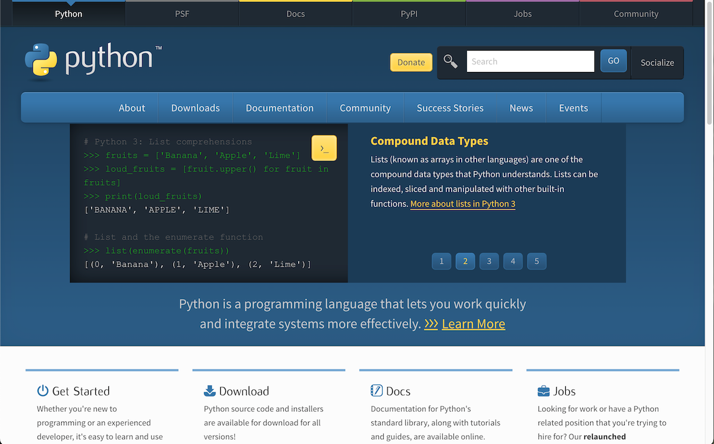
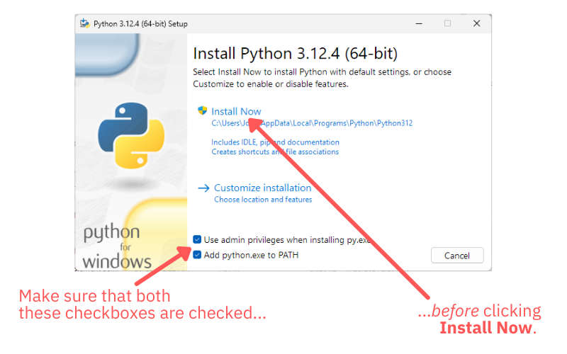

# Instructions

Before you can start building computational notebooks, you need to set up Python and JupyterLab on your computer. These instructions will guide you through this process.


## Setting Up Python

The first step in this course is to install Python. 

Python is an open source project, which means that there are a number of Python distributions to choose from. This course will use the Python distribution from [python.org](https://www.python.org/), the official website for the Python programming language. 

> The official version of Python is also known as _CPython_. This name comes from the fact that it’s implemented in C and C++ (as are many other programming languages and operating systems).

The processes for setting up Python differ among operating systems, so these instructions cover doing so on Windows, macOS, and Linux.

### Setting Up Python on Windows

If you’re on Windows, the simplest way to install Python on your system is to use python.org’s Windows installer.

Go to [python.org](https://www.python.org/) and move your mouse over the **Downloads** menu bar item:



A pop-up should appear. It will have a button that you can click to download Python for Windows. Click that button to download the Python installer.

The installer will have the name like `python-3.12.x-amd64.exe`. By default, it should be downloaded to your _Downloads_ folder.

Double-click the installer to launch it. You should see this opening screen:



To avoid the problem where Windows can’t find Python, check these two checkboxes at the bottom of the installer’s opening screen:

- The **Use admin privileges when installing py.exe** checkbox
- The **Add python.exe to PATH** checkbox

Once you’ve checked those boxes, click the **Install Now** button to start the installation process.

Once the process completes, confirm that Python was properly installed on your computer. Do this by launching PowerShell and then entering the following in PowerShell’s command-line interface:

```
py --version
```

> If you’re not familiar with PowerShell, you can launch it by pressing Windows+r, entering `powershell` in the pop-up window that appears and clicking its **OK** button.

You should receive a single-line response immediately below the line where you entered `py --version` that looks something like this...

```
Python 3.12.y
```

...where `y` can be any number. If you get a response like this, Python has been installed on your computer and you can proceed to the next section, _Installing JupyterLab_.

### Setting Up Python on macOS

If you’re on macOS, the simplest way to install Python on your system is to use python.org’s macOS installer.

Go to [python.org](https://www.python.org/) and move your mouse over the **Downloads** menu bar item:


A pop-up should appear. It will have a button that you can click to download Python for Windows. Click that button to download the Python installer.

The macOS Python installer will have the name like `python-3.12.4-macos11.pkg`. By default, it should be downloaded to your *Downloads* folder.

Double-click the installer to launch it. You might see a window that says “‘Installer’ would like to access files on a removable volume.” If you see it, click the **Allow** button:


The installer will proceed to show you a few windows where you will need to click on buttons labeled **Continue**, **Agree**, and **Install**. Click these buttons as they appear until the installation begins.

Once the process completes, you should follow the instructions on the final screen of the installer:

> One more thing: to verify the identity of secure network connection, this Python needs a set of SSL root certificates. You can download and install a current curated set from the Certifi project by double-clicking on the Install Certificates icon in the Finder window. See the ReadMe file for more information.

Follow these instructions by opening the _Applications_ folder. Inside that folder, find the Python 3.12 folder and open it. You should see something like this:


Double-click the item named **Install Certificates.command**. It will open a Terminal window and run, displaying a stream of messages that should include something similar to following at or near the end:

```
Successfully installed certifi-202x.y.z
```

Finally, you should confirm that Python was properly installed on your computer. Do this by launching Terminal and then entering the following in Terminal’s command-line interface:

```
python3 --version
```

> If the above gives you an error, try entering `python --version` instead.

> If you’re not familiar with Terminal, you can launch it by pressing command+space to launch _Spotlight Search_, entering `terminal` in _Spotlight’s_ text field and pressing the **return** key.

You should receive a single-line response immediately below the line where you entered `python3 --version` or `python --version` that looks something like this...

```
Python 3.12.y
```

...where `y` can be any number. If you get a response like this, Python has been installed on your computer and you can proceed to the next section, _Installing JupyterLab_.

### Setting Up Python on Linux

If you’re using Linux, you should first see if a recent-enough version of Python already exists on your system. Any version from 3.10 and later should suffice for this course.

Open a terminal and enter the following command to see if Python is on your system, and if so, which version it is:

```
python --version
```

If the above gives you an error, try entering this command instead:

```
python3 --version
```

In either case, you should receive a single-line response immediately below the line where you entered that looks something like this...

```
Python 3.x.y
```

If the response is something like `Python 3.x.y` where `x` is `10` or greater, Python has been installed on your computer and you can proceed to the next section, _Installing JupyterLab_.


## Installing JupyterLab

The next step is to install JupyterLab, which you’ll do with `pip`, Python’s command-line package installer.

Install JupyterLab by running the following command on the command line (*Windows PowerShell* on Windows or *Terminal* on macOS and Linux):

```
pip install jupyterlab
```

> If you’re on macOS or Linux and the above command didn’t work, try replacing `pip` with `pip3`.

The installation process will generate a lot of messages. If it doesn’t end with an error message, your system should be properly set up for this course.

Confirm that JupyterLab was installed by using `pip` to list the currently installed packages. Enter the following on the command line:

```
pip list
```

`pip` will list all the installed packages. If one of the items in the list is `jupyterlab` and its version is 4.2.0 or later, JupyterLab is set up on your computer and you can proceed to the next step in this lesson.
