# Instructions

Now that you’ve installed Python and JupyterLab, it’s time to learn how to use them.

## Learning JupyterLab

JupyterLab is the environment in which you’ll create and edit _notebooks_, the interactive documents that combine code, text, images, and visualizations. You’ll use JupyterLab throughout this course, so it’s important that you become familiar with it.

In the process, you’ll also get some early exposure to Python, which will be covered in more more detail later on in this lesson.

### Launching JupyterLab

To launch JupyterLab, enter the following command in your operating system’s command-line interface (PowerShell in Windows, Terminal on macOS or Linux):

```
jupyter lab
```

You’ll see a few messages appear on the command line, after which your default web browser will open a new tab or window that looks something like this:

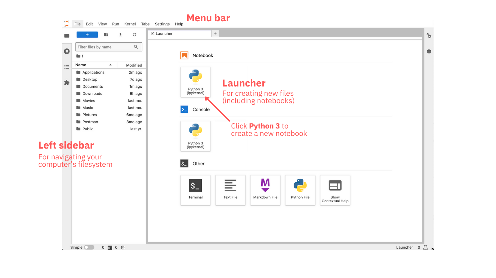

This is the JupyterLab interface as it appears when first launched. You should see the following:

- At the top is the menu bar, where you’ll find often-used commands.
- The left sidebar is for navigating and managing your computer’s filesystem. You’ll use this often to find, open, and manage notebooks.
- Most of the space is taken up by the main work area, currently occupied by the Launcher, which gives you several options for creating new files.

It’s time to create your first notebook!

### Your First Notebook

To create a new notebook, click the **Python 3** button in the Launcher’s **Notebook** section. This will create a new notebook, which should look like this:

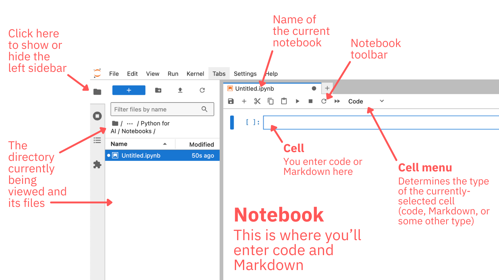

You’ll see that the Launcher has been replaced your newly-created notebook. The main work area is now occupied by the new notebook, which has the default filename `Untitled.ipynb`.

> `ipynb` is the filename extension for Jupyter notebooks. The name comes from the original name: “IPython Notebooks.”

By default, JupyterLab presents a tabbed interface similar to a browser’s, which allows for several notebooks to be open at the same time. As you continue developing notebooks, you may find that you have as many open notebook tabs as open browser tabs!

Before you start working with the notebook, save it.

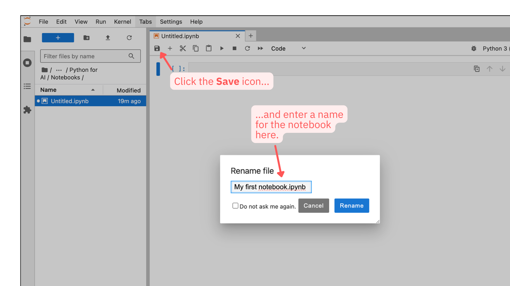

Click the toolbar’s **Save** button. The **Rename file** pop-up will appear. Enter a new name for your notebook — if you can’t think of one, `My first notebook` will do — and click the **Rename** button.

It’s time to start coding!

### Code Cells

A new notebook starts with a single cell: a **code cell**, where you can enter and execute code.  which is a notebook cell that contains and can execute code. By default, notebook cells are code cells.

Enter the following code into the cell:

```python
# A classic program!
print("Hello, Python world!")
```

Run the code. You can do this by selecting the cell and either:

- Clicking the **Run** button in the menu bar, or
- Pressing **Shift-Enter** on your keyboard.

You should see “Hello, Python world!” appear immediately below the code cell, and your notebook should look like this:

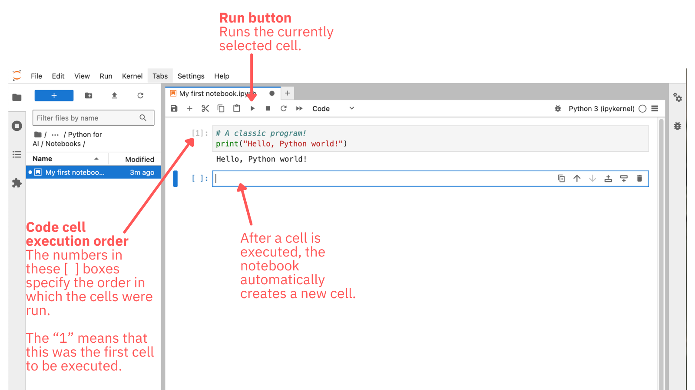

When you run a code cell, the code in that cell executes, after which the notebook presents you with a new code cell.

Here’s a quick explanation of the code you just entered and ran:

- The `#` symbol starts single-line comments in Python, just as `//` starts single-line comments in many programming languages.
- Python has a `print()` function (similar to JavaScript’s `console.log()` or Java’s `System.out.println()`) that can be used to print messages to the console. In Jupyter, anything printed to the console appear immediately after the code cell that generated that output.

### Markdown Cells

Notebooks have another cell type: a **Markdown cell**, which contains and can render Markdown, a markup language for writing web content requires less typng than HTML.

> Introducing Markdown is beyond the scope of this lesson. If you’re unfamiliar with Markdown, take a look at [GitHub’s guide to Markdown](https://docs.github.com/en/get-started/writing-on-github/getting-started-with-writing-and-formatting-on-github/basic-writing-and-formatting-syntax), [the interactive tutorial at markdowntutorial.com](https://www.markdowntutorial.com/), or [the markdown guide at markdownguide.org](https://www.markdownguide.org/).

Select the empty cell just below the cell where you entered code. You’ll need to change it from a code cell to a Markdown cell, which you do by selecting **Markdown** from the drop-down menu in Jupyter’s menu bar, then enter the following into the new Markdown cell:

```
# My First Jupyter Notebook

## Introduction
**This** will be the first of _many_ notebooks that I'll use while taking [Kodeco.com's](https://www.kodeco.com/) AI courses!
```

The notebook should now look like this:

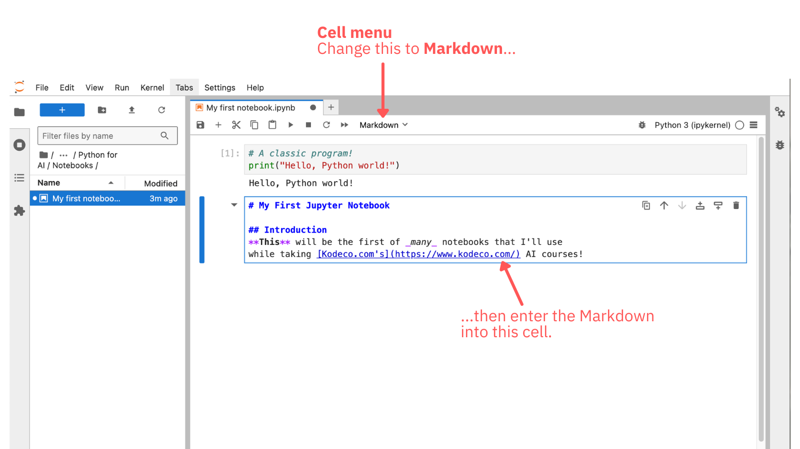

Markdown cells render when you run them, so do that. As with code cells, you run a Markdown cell by selecting the cell and either:

- Clicking the **Run** button in the menu bar, or
- Pressing **Shift-Enter** on your keyboard.

The cell will render its contents, transforming its Markdown into rendered HTML, as shown in the screenshot below:

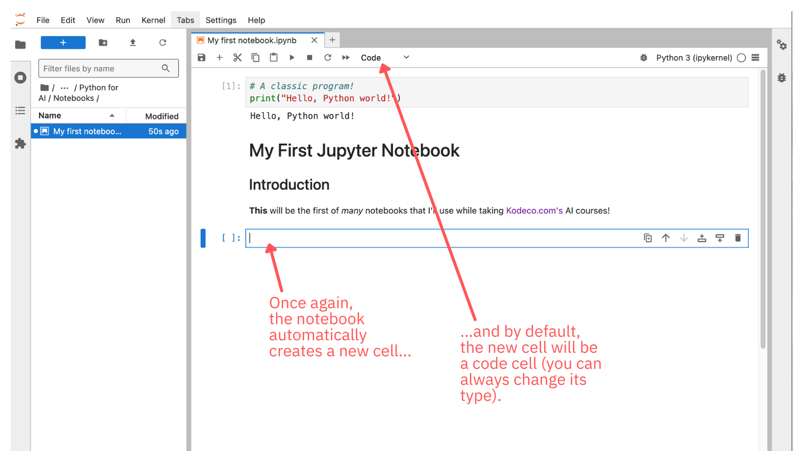

To make edits to a rendered Markdown cell, simply double-click on that cell. The contents of the cell will transform from rendered HTML back into Markdown.

### Selecting and Moving Cells

You can select a cell by clicking on it. Click on the Markdown cell you just created. If the Markdown cell is still showing rendered HTML, double-click on it to view the cell in Markdown mode:


A selected cell is highlighted by a colored bar to its left and a colored border, and it also displays a set of buttons at its upper right corner:

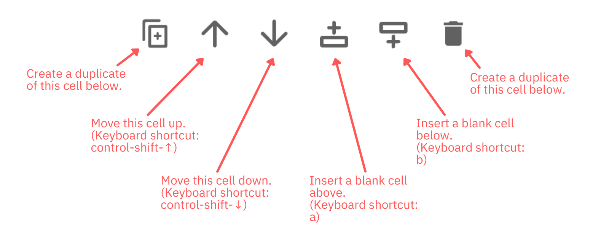

From left to right, these buttons do the following:

- Create a duplicate of the cell immediately below the current cell.
- Move the cell up. This has a keyboard shortcut: _control-shift-↑_ (and on macOS, it’s _control_, not command).
- Move the cell down. This has a keyboard shortcut: _control-shift-↓_ (and on macOS, it’s _control_, not command).
- Insert a blank cell above the current cell. This has a keyboard shortcut: _a_.
- Insert a blank cell below the current cell. This has a keyboard shortcut: _b_.

> The keyboard shortcuts for cells work only when the entire cell is selected. If you’re editing code or Markdown in a cell, only the cell’s text box is selected and the keyboard shortcuts are inactive.

The Markdown cell would make a good introduction for this notebook. Move it to the top of the notebook by clicking on the button that moves the cell up, then render the Markdown by running the cell. 

The notebook should now look like this:

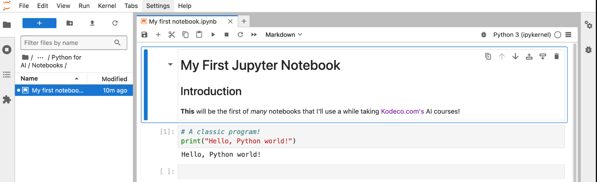

Notebooks can have any combination of code and Markdown cells. The size of a notebook is limited only by disk space.

### Code Cells’ Order of Execution

Select the cell immediately after the code cell. If there’s no such cell, create one by selecting the code cell and clicking its “insert blank cell below” button.

Enter the following into the cell and run it:

```python
score = 0
```

Unlike the `print()` function in the other code cell, the code in this cell doesn’t produce any output. It simply creates the `score` variable and assigns the value `0` to that variable.

The notebook should now look like this:

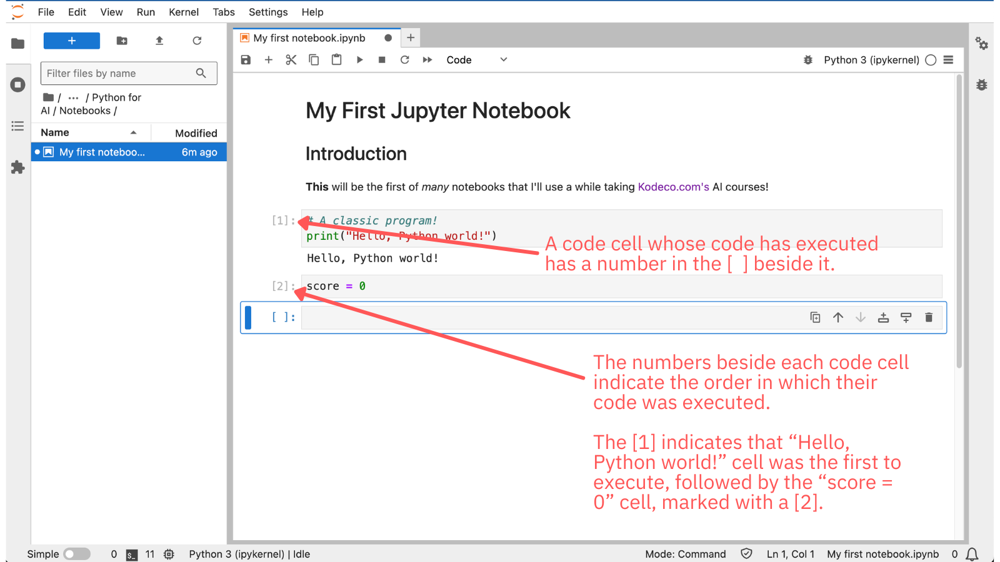

Note that each code cell that has executed has a number in the [ ] beside it. The presence of a number indicates that the code in that cell has executed, and that number specifies the order in which the code was executed.

As you can see from the numbers, the “Hello, Python world!” cell, which has `[1]` beside it, executed first, followed by the “`score = 0`” cell, which has `[2]` beside it.

### Variable Scope and Displaying Values

If you enter the name of a variable, an expression, or an object into a code cell and run that cell, the notebook will display Python’s evaluation of that variable, expression or object.

Run the following in a new code cell:

```python
score
```

Note that `score` is available in this cell even though it was defined in another cell. That’s because once you define a variable in a notebook, it is in scope for code in any cell in the same notebook that you run afterward.

`score`’s value, `0`, should appear below the code cell. You’ll also see `[3]` beside the code cell, indicating that it was the third code cell whose code was executed.

Enter the following into a new code cell and run it:

```python
score > -1
```

Python evaluates the expression `score > -1` as `True` and its evaluation is displayed below the cell.

> Unlike most other programming languages, Python’s boolean values, `True` and `False`, are capitalized.

Since `score > -1` is the fourth code cell that was run, `[4]` appears beside the cell.

### Cells Can Be Run in Any Order 

Using a new code cell, change the value of `score` to 5:

```python
score = 5
```

This cell doesn’t result in any output. Since it’s the fifth code cell to execute, it has `[5]` beside it.

Now highlight the code cell where you simply entered `score`, as shown below...

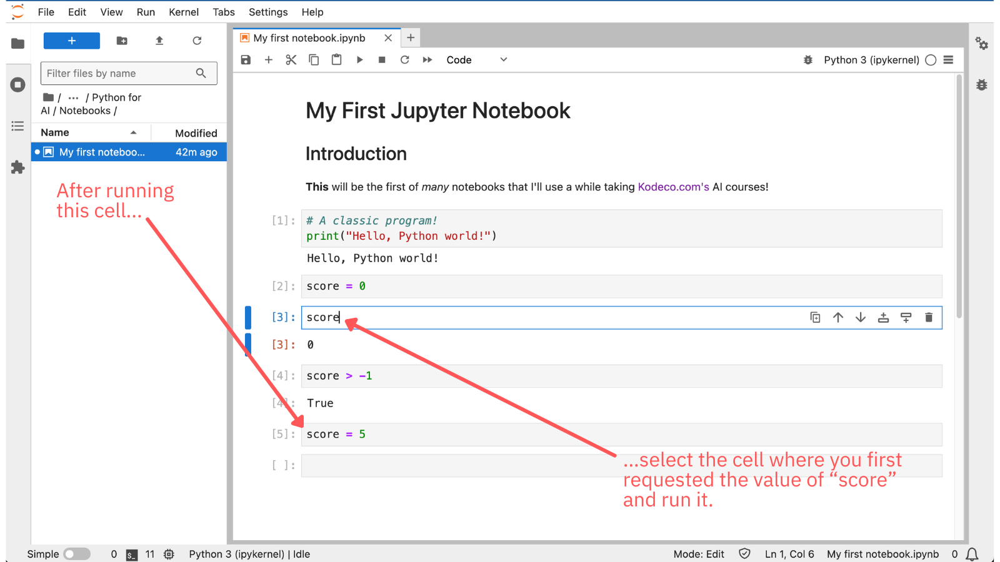

...and run it again. You should see this:

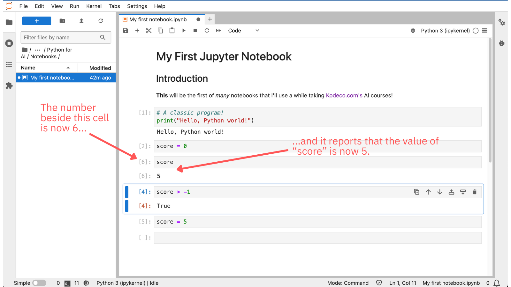

The cell’s output now shows that `score` contains the value `5`. The `[6]` beside it indicates that its code was run _after_ you updated `score`’s value from `0` to `5`.

This demonstrates cells can be run in any order, and the code in a cell can change any variables defined by code in cells that were run previously.

### Defining and Redefining Functions

Run the following in a new code cell (there should be one at the bottom of the notebook; otherwise, you can create one):

```python
# A simple Python function
def say_hello():
    print("Hello there!")
```

Running the cell doesn’t produce any visible results, but it has an _invisible_ effect: there is now a function named `say_hello()` that code in any subsequent cell can call.

Invoke `say_hello()` by entering this into a new code cell and running it:

```python
say_hello()
```

The text “Hello there!” should appear below the cell.

Note that like variables, once a function is defined, it’s in scope for code in any cell in the same notebook that you run afterward.

In a new code cell (running the previous code cell should have created a new one), run the following:

```python
# Redefine `say_hello()`
def say_hello():
    print("I'm going to say 'Howdy' instead!")
```

This will redefine the function. If you now invoke it — either by calling `say_hello()` in a new code cell or re-running the code cell that calls it — it will print “I'm going to say 'Howdy' instead!”

### Long-Running Cells

A code cell will display an indicator while running code. You probably haven’t noticed that because the code cells you’ve been running so far have executed almost instantaneously.

Enter the following into a new code cell, but don’t run it yet:

```python
import time
time.sleep(10)
```

Some notes about the code:

- Python’s `import` statement is like those from many other languages: it imports the functionality of a library. In this case, the `time` library is being imported for its `sleep()` function.
- The `sleep()` function stops the execution of the current thread for a given number of seconds.

Run the cell. You should see something like this:

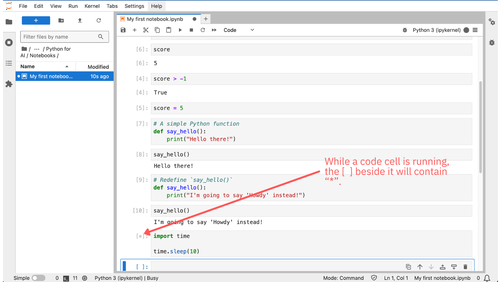

The call to `sleep()` keeps the cell running long enough for you to see the `*` indicator beside the cell. This indicator tells you that the cell is still executing code.

While a cell is executing code, no other cell can execute code; they have to wait until the cell currently executing code has finished.

You can interrupt a cell that’s running code by clicking the “stop” button in the toolbar.

### Executing Shell Commands

You can execute shell commands from a code cell. Any line that starts with `!` will execute in your operating system’s shell. This is useful for executing `pip` commands to install Python packages required by a notebook.

If you’re on macOS or Linux, run the following in a new code cell:

```
# Run this on macOS and Linux only
! ls
```

You should see a listing of the current directory below the cell.

If you’re on Windows, enter the following into a new code cell and run it:

```
# Run this on Windows only
# (See the note below)
! dir
```

This will produce a list of the current directory below the shell.

On Windows, JupyterLab sends commands from lines beginning with `!` to Command Prompt (the one that runs DOS commands), even if you launched JupyterLab from PowerShell. That’s why the command above was `dir` and not `ls`.

To send commands to PowerShell, use this format:

```
! Powershell.exe -Command "Your command here"
```

For example, this command gets a listing of the current directory from PowerShell:

```
! Powershell.exe -Command "ls"
```

### Restarting the Kernel

There will come a time, when after running several code cells, you may want to re-run your code and have JupyterLab “forget” anything you have defined. 

The simplest way to do this is to restart the _kernel_, the “engine” that executes the code and manages the state of variables and anything else your code defines.

Try it out — restart the kernel by clicking the “restart kernel” button in the toolbar (the one with the icon that looks like a browser’s “refresh” button). A pop-up will appear, asking you to confirm that you want to restart the kernel; click the _Restart_ button.

Then, before running any other code cells, run the code cell that displays the contents of the `score` variable. This should result in an error message:

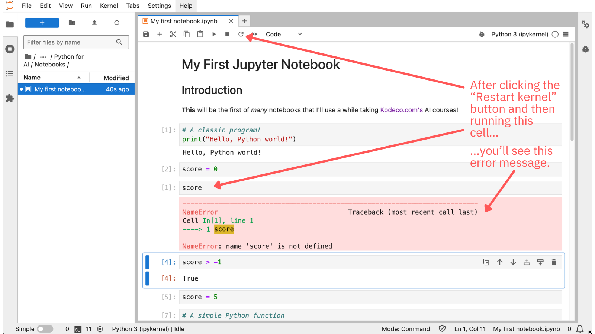

Restarting the kernel brought it back to its initial state. The contents of your notebook are still there, but as far as the kernel is concerned, you haven’t run any code yet.